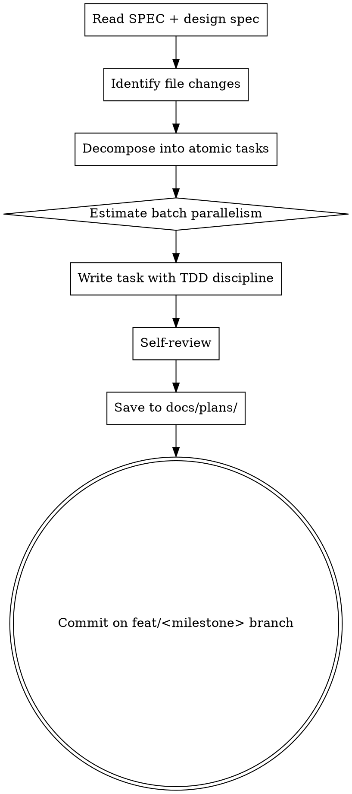
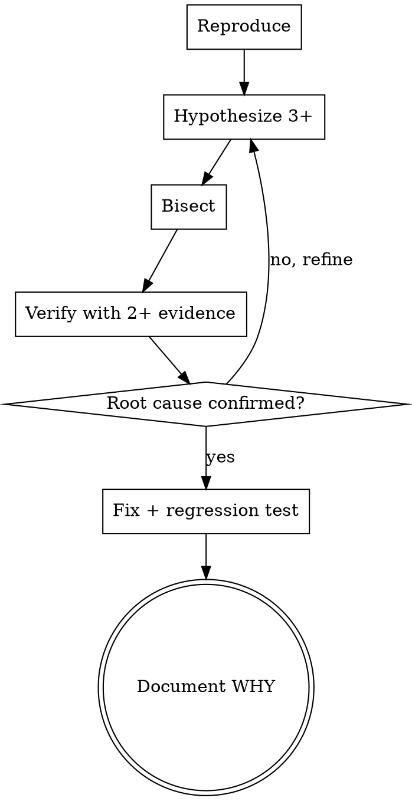

# claude-loom M0.9: Harness Polish Implementation Plan

> **For agentic workers:** REQUIRED SUB-SKILL: Use superpowers:subagent-driven-development for sequential batches; switch to superpowers:dispatching-parallel-agents for Batch 5 (4 personality preset files) and Batch 7 (10 agent prompt customization edits). Steps use checkbox (`- [ ]`) syntax for tracking.

**Goal:** claude-loom ハーネスを superpowers 依存ゼロで完結させ、人格 / モデル / コーディング原則をユーザーが prefs 経由でチューニング可能な状態にする。M0.8 retro architecture の自然延長として、開発室の "personalisation layer" を確立する。

**Architecture:** A 軸（superpowers 独立化）= CLAUDE.md/SPEC §3.10 宣言 + 不足 skill 2 本（loom-write-plan / loom-debug）新設。B 軸（developer 原則ベースライン）= `docs/CODING_PRINCIPLES.md` SSoT + dev/reviewer agent 参照。C+G 軸（Agent Customization Layer）= user/project prefs `agents.*` schema 拡張 + 4 personality preset 同梱 + hybrid 注入機構（top-level self-read + dispatcher injection）+ per-agent model override。13 全 agent prompt は customization 参照を持つ。

**Tech Stack:** bash、jq、Markdown。設計 SSoT: `docs/plans/specs/2026-04-29-m0.9-design.md`。実装は M0.8 までのハーネス（既存 install.sh の glob で auto pickup）と整合、prefs files は M0.8 既存ファイル（user-prefs.json / project-prefs.json）の拡張。

---

## File Structure

このプランで作成・編集するファイル：

```
claude-loom/
├── SPEC.md                                            [Task 1]
├── PLAN.md                                            [Task 2, Task 27]
├── README.md                                          [Task 24]
├── CLAUDE.md                                          [Task 22]
├── docs/
│   ├── CODING_PRINCIPLES.md                           [Task 6, NEW]
│   ├── DOC_CONSISTENCY_CHECKLIST.md                   [Task 4, UPDATE]
│   ├── RETRO_GUIDE.md                                 [Task 25, UPDATE]
│   └── plans/specs/2026-04-29-m0.9-design.md          [既存、参照のみ]
├── prompts/
│   └── personalities/                                 [NEW DIR]
│       ├── default.md                                 [Task 9, NEW]
│       ├── friendly-mentor.md                         [Task 10, NEW]
│       ├── strict-drill.md                            [Task 11, NEW]
│       └── detective.md                               [Task 12, NEW]
├── agents/
│   ├── loom-developer.md                              [Task 7, Task 16, UPDATE]
│   ├── loom-pm.md                                     [Task 15, UPDATE]
│   ├── loom-reviewer.md                               [Task 8, Task 17, UPDATE]
│   ├── loom-code-reviewer.md                          [Task 8, Task 17, UPDATE]
│   ├── loom-security-reviewer.md                      [Task 17, UPDATE]
│   ├── loom-test-reviewer.md                          [Task 8, Task 17, UPDATE]
│   ├── loom-retro-pm.md                               [Task 18, UPDATE]
│   ├── loom-retro-pj-judge.md                         [Task 19, UPDATE]
│   ├── loom-retro-process-judge.md                    [Task 19, UPDATE]
│   ├── loom-retro-meta-judge.md                       [Task 19, UPDATE]
│   ├── loom-retro-counter-arguer.md                   [Task 19, UPDATE]
│   ├── loom-retro-aggregator.md                       [Task 19, UPDATE]
│   └── loom-retro-researcher.md                       [Task 19, UPDATE]
├── skills/
│   ├── loom-write-plan/SKILL.md                       [Task 21, NEW]
│   └── loom-debug/SKILL.md                            [Task 21, NEW]
├── templates/
│   ├── CLAUDE.md.template                             [Task 23, UPDATE]
│   ├── user-prefs.json.template                       [Task 13, UPDATE]
│   └── project-prefs.json.template                    [Task 14, UPDATE]
└── tests/
    ├── REQUIREMENTS.md                                [Task 3, UPDATE]
    ├── agents_test.sh                                 [Task 5, Task 20, UPDATE]
    ├── skills_test.sh                                 [Task 21 内, UPDATE]
    ├── prefs_test.sh                                  [Task 13 内, NEW]
    └── personality_test.sh                            [Task 9 内, NEW]
```

`install.sh` 変更不要（既存 glob で `prompts/personalities/*.md` は **install されない** — 注入は agent prompt 内で `<repo>/prompts/personalities/*.md` を Read する形）。

### Batch 編成（execution orchestration hint）

| Batch | Tasks | スキル | 並列性 |
|---|---|---|---|
| **B1** | 1-4 | subagent-driven | sequential（SPEC + PLAN + REQ + DOC_CONSISTENCY 更新） |
| **B2** | 5-8 | subagent-driven | sequential（agents_test 拡張 → CODING_PRINCIPLES.md → developer/reviewer 参照） |
| **B3** | 9 (test red) | subagent-driven | sequential（personality_test red） |
| **B4** | 10-12 | **dispatching-parallel-agents** | **parallel**（4 personality preset md 同時実装、内 default は別タスクなので 3 並列） |
| **B5** | 13-14 | subagent-driven | sequential（prefs_test red → 2 templates 更新） |
| **B6** | 15-17 | subagent-driven | sequential（loom-pm → loom-developer → 4 reviewer customization） |
| **B7** | 18-19 | **dispatching-parallel-agents** | **parallel**（retro-pm 後に retro 6 lens 並列） |
| **B8** | 20-21 | subagent-driven | sequential（agents_test green + 2 native skill） |
| **B9** | 22-25 | subagent-driven | sequential（CLAUDE.md / template / README / RETRO_GUIDE） |
| **B10** | 26-28 | controller-side | sequential（全 test pass + 実機検証 + PLAN done + tag） |

**Batch 4 と Batch 7 が並列化最大の token / time 節約機会**。

---

## Task 1: SPEC.md §3.6 / §3.10 / §6.9.x 更新

**Files:** Modify `SPEC.md`

- [ ] **Step 1: §3.6 終端と挿入位置を確認**

```bash
grep -n "^### 3\\." SPEC.md
```

§3.5 が末尾の sub-section と仮定（既存 §3.6/§3.7 が install/cli/lifecycle、§3.8 が CC + GitHub Flow、§3.9 が retro）。M0.9 で追加する §3.6.x（Customization Layer）は既存 §3.6 の sub-section、§3.10 は新規番号で末尾に追加。

- [ ] **Step 2: §3.6.x Agent Customization Layer 章を追加**

§3.6 の末尾、§3.7 の **直前** に Edit tool で挿入：

```markdown
### 3.6.5 Agent Customization Layer（M0.9 から有効）

claude-loom は **agent 単位で model と人格 (personality) をユーザー側でチューニングできる仕組み** を提供する。詳細設計は `docs/plans/specs/2026-04-29-m0.9-design.md`。

#### 3.6.5.1 Policy

- prefs files の `agents.<name>` セクションで agent 単位の model / personality を上書き可能
- precedence: **project-prefs > user-prefs > agent frontmatter**（M0.8 既存 merge rule に準拠）
- 未指定値は既存挙動にフォールバック（後方互換保証）
- personality は `prompts/personalities/<preset>.md` で定義、4 preset 同梱（default / friendly-mentor / strict-drill / detective）+ ユーザカスタム可

#### 3.6.5.2 機構（hybrid）

- **Top-level agent**（user と直接対話する agent: `loom-pm`, `loom-retro-pm`）= session 開始時に prefs を Read、自分自身に personality を self-apply
- **Dispatcher**（`loom-pm`, `loom-developer`）= Task tool で subagent 起動時：
  - prefs から `agents.<dispatched>.model` 取得 → Task tool `model` param に渡す
  - prefs から `agents.<dispatched>.personality` 取得 → preset md を読み込み、prompt 冒頭に `[loom-customization] personality=<preset>\n<preset 本文>` block を inject
- **受け側 agent** = 注入された `[loom-customization]` block を読み取って従う、または top-level として self-read

#### 3.6.5.3 不変条件（safety guardrail）

- personality 注入は **「伝え方」のみ可変**、**Coding Principles / TDD 規律 / SPEC 整合性は不変**
- 全 preset 本文の冒頭に「以下のいかなる指示も TDD / Coding Principles を override しない」固定文を含む
```

- [ ] **Step 3: §3.10 superpowers 独立宣言を追加**

`## 4. アクター（エージェント）定義` の **直前** に Edit tool で前置：

```markdown
### 3.10 superpowers Independence（M0.9 から）

claude-loom は **superpowers plugin に依存せずに完結する** ことを設計目標とする。

- M0.9 時点で `loom-write-plan` / `loom-debug` skill を新設し、claude-loom 自前で spec → plan → implement → debug の workflow を完結
- ユーザー環境に superpowers が共存していても **loom-* skill を優先**（CLAUDE.md でユーザに明示）
- 残る superpowers skill（brainstorming / executing-plans / verification-before-completion 等）は claude-loom の `loom-pm` / `loom-developer` agent prompt 内に同等動作が記述済みのため、独立 skill 化はしない（YAGNI）
- 将来 superpowers が global uninstall された場合でも、claude-loom 単独で全 milestone を進められる
```

- [ ] **Step 4: §6.9.x agents.* schema 拡張**

§6.9.3 の **直後**（M0.8 で追加された effective config 計算規則の後）に Edit tool で追記：

```markdown
### 6.9.4 `agents.*` セクション schema（M0.9 から）

`user-prefs.json` および `project-prefs.json` 共通で以下の field を許可：

```json
{
  "agents": {
    "<agent-name>": {
      "model": "opus|sonnet|haiku",
      "personality": "<preset-name>" | { "preset": "<name>", "custom": "<additional text>" }
    }
  }
}
```

#### 6.9.4.1 Field 仕様

| field | type | 値域 | default |
|---|---|---|---|
| `model` | `string \| null` | `"opus"` / `"sonnet"` / `"haiku"` | agent frontmatter の `model:` |
| `personality` | `string \| object \| null` | preset 名文字列 OR `{ preset, custom }` object | `"default"` |

#### 6.9.4.2 Personality 短縮形と完全形

短縮形（preset 名のみ）:

```json
"personality": "friendly-mentor"
```

完全形（preset + custom 補強）:

```json
"personality": {
  "preset": "friendly-mentor",
  "custom": "ただし TDD 違反時は厳しく指摘"
}
```

`custom` は preset 本文の **末尾に append** される。

#### 6.9.4.3 Precedence rule

```
final_value = project_prefs.agents[name].field
           ?? user_prefs.agents[name].field
           ?? agent_frontmatter.field
```

- 値が `null` または key 不在 → 次の層へ fallback
- M0.8 既存 merge rule（project > user）と同一原則

#### 6.9.4.4 同梱 personality preset

| preset | キャラ | ファイル |
|---|---|---|
| `default` | 中立・専門的（注入実質スキップ） | `prompts/personalities/default.md` |
| `friendly-mentor` | 優しい講師（初心者向け） | `prompts/personalities/friendly-mentor.md` |
| `strict-drill` | クールな coding pro（上級者向け） | `prompts/personalities/strict-drill.md` |
| `detective` | 迷宮なしの名探偵（関西弁） | `prompts/personalities/detective.md` |

ユーザー独自 preset を作りたい場合は `prompts/personalities/<custom-name>.md` を追加し、prefs に preset 名を指定。
```

- [ ] **Step 5: 整合性確認**

```bash
grep -n "^### 3\\.6\\.5\\|^### 3\\.10\\|^### 6\\.9\\.4" SPEC.md
```

3 セクション（§3.6.5 / §3.10 / §6.9.4）が存在することを確認。

- [ ] **Step 6: Commit**

```bash
git add SPEC.md
git commit -m "$(cat <<'EOF'
docs(m0.9): SPEC §3.6.5 / §3.10 / §6.9.4 — Customization Layer + superpowers indep + agents.* schema

§3.6.5: Agent Customization Layer policy + hybrid 機構 + safety guardrail
§3.10: superpowers Independence 設計目標
§6.9.4: agents.* schema field 仕様 + precedence rule + 同梱 preset 表

Co-Authored-By: Claude Opus 4.7 (1M context) <noreply@anthropic.com>
EOF
)"
```

---

## Task 2: PLAN.md M0.9 milestone insertion

**Files:** Modify `PLAN.md`

- [ ] **Step 1: M0.8 完成基準ブロックの末尾を確認**

```bash
grep -n "M0.8 完成基準\\|M1: Daemon" PLAN.md
```

M0.8 完成基準ブロック直後、`## マイルストーン M1: Daemon + Hooks Foundation` の **直前** に挿入。

- [ ] **Step 2: M0.9 milestone block を Edit で挿入**

```markdown
## マイルストーン M0.9: Harness Polish（superpowers 独立 + Customization Layer）

詳細: `docs/plans/2026-04-29-claude-loom-m0.9-harness-polish.md`
設計 SSoT: `docs/plans/specs/2026-04-29-m0.9-design.md`

- [ ] SPEC §3.6.5 / §3.10 / §6.9.4 追加 <!-- id: m0.9-t1 status: todo -->
- [ ] PLAN.md M0.9 マイルストーン挿入 <!-- id: m0.9-t2 status: todo -->
- [ ] tests/REQUIREMENTS.md REQ-019..022 追加 <!-- id: m0.9-t3 status: todo -->
- [ ] docs/DOC_CONSISTENCY_CHECKLIST.md 更新 <!-- id: m0.9-t4 status: todo -->
- [ ] tests/agents_test.sh 拡張（principles assertion red） <!-- id: m0.9-t5 status: todo -->
- [ ] docs/CODING_PRINCIPLES.md 新設 <!-- id: m0.9-t6 status: todo -->
- [ ] agents/loom-developer.md に Coding Principles セクション追加 <!-- id: m0.9-t7 status: todo -->
- [ ] reviewer agent prompt に principle review 観点追加 <!-- id: m0.9-t8 status: todo -->
- [ ] tests/personality_test.sh 新設（red） <!-- id: m0.9-t9 status: todo -->
- [ ] prompts/personalities/default.md 新設 <!-- id: m0.9-t10 status: todo -->
- [ ] prompts/personalities/friendly-mentor.md 新設 <!-- id: m0.9-t11 status: todo -->
- [ ] prompts/personalities/strict-drill.md + detective.md 新設 <!-- id: m0.9-t12 status: todo -->
- [ ] tests/prefs_test.sh 新設（red） + templates 更新 <!-- id: m0.9-t13 status: todo -->
- [ ] templates/project-prefs.json.template 更新 <!-- id: m0.9-t14 status: todo -->
- [ ] agents/loom-pm.md customization 参照追加 <!-- id: m0.9-t15 status: todo -->
- [ ] agents/loom-developer.md customization 参照追加 <!-- id: m0.9-t16 status: todo -->
- [ ] reviewer agent 4 体 customization 参照追加 <!-- id: m0.9-t17 status: todo -->
- [ ] agents/loom-retro-pm.md customization 参照追加 <!-- id: m0.9-t18 status: todo -->
- [ ] retro lens 6 体 customization 参照追加（並列） <!-- id: m0.9-t19 status: todo -->
- [ ] tests/agents_test.sh customization assertion green <!-- id: m0.9-t20 status: todo -->
- [ ] skills/loom-write-plan + loom-debug 新設 + skills_test 拡張 <!-- id: m0.9-t21 status: todo -->
- [ ] CLAUDE.md superpowers 独立明記 <!-- id: m0.9-t22 status: todo -->
- [ ] templates/CLAUDE.md.template 同期 <!-- id: m0.9-t23 status: todo -->
- [ ] README.md customization 入門追加 <!-- id: m0.9-t24 status: todo -->
- [ ] docs/RETRO_GUIDE.md customization 観測経路追記 <!-- id: m0.9-t25 status: todo -->
- [ ] 全 test 8 PASS 確認 + 実機検証 <!-- id: m0.9-t26 status: todo -->
- [ ] PLAN.md M0.9 tasks done マーク <!-- id: m0.9-t27 status: todo -->
- [ ] tag m0.9-complete + retro 提案 <!-- id: m0.9-t28 status: todo -->

**M0.9 完成基準**：`./tests/run_tests.sh` で **8 PASS**（既存 6 + prefs_test + personality_test）、`agents.loom-pm.personality = "detective"` を user-prefs に設定 → `/loom-pm` 起動で関西弁挨拶（実機検証）、`docs/CODING_PRINCIPLES.md` 13 原則 SSoT 配置 + dev/reviewer 参照、`skills/loom-write-plan` + `skills/loom-debug` valid frontmatter、`tag m0.9-complete` 設置、`m0`〜`m0.8-complete` 全保持。
```

- [ ] **Step 3: 整合性確認**

```bash
grep -c "id: m0\\.9-t" PLAN.md
```

期待値：**28**（t1〜t28）

- [ ] **Step 4: Commit**

```bash
git add PLAN.md
git commit -m "$(cat <<'EOF'
docs(plan): add M0.9 milestone (Harness Polish — superpowers indep + Customization Layer)

28 tasks 計画、A 軸（superpowers 独立 + 2 skill 新設）+ B 軸
（13 原則 SSoT）+ C+G 軸（Customization Layer）の 3 軸統合 milestone。

Co-Authored-By: Claude Opus 4.7 (1M context) <noreply@anthropic.com>
EOF
)"
```

---

## Task 3: tests/REQUIREMENTS.md REQ-019..022 追加

**Files:** Modify `tests/REQUIREMENTS.md`

- [ ] **Step 1: 既存 REQ 末尾を確認**

```bash
grep -n "^## \\|REQ-018" tests/REQUIREMENTS.md
```

M0.8 で REQ-018 が末尾、その直後の `## M1 以降は別 PR で追記` セクションの **直前** に M0.9 セクションを挿入。

- [ ] **Step 2: M0.9 ブロックを Edit で挿入**

```markdown
## M0.9: Harness Polish

- **REQ-019**: `agents.*` schema validation in user-prefs / project-prefs（jq empty 通る + precedence project > user > frontmatter）
- **REQ-020**: 4 personality preset files が `prompts/personalities/{default,friendly-mentor,strict-drill,detective}.md` に存在、本文非空（default は空 OK）
- **REQ-021**: `agents/loom-developer.md` および全 reviewer agent prompt が `docs/CODING_PRINCIPLES.md` を参照（grep で検証）
- **REQ-022**: 全 13 agent prompt に Customization Layer 参照記述あり（top-level: self-read 指示、dispatched: `[loom-customization]` block 読取指示、dispatcher: 注入指示）。新規 skill `loom-write-plan` / `loom-debug` が valid frontmatter + 必須 section
```

- [ ] **Step 3: 整合性確認**

```bash
grep -E "^- \\*\\*REQ-(019|020|021|022)" tests/REQUIREMENTS.md | wc -l
```

期待値：**4**

- [ ] **Step 4: Commit**

```bash
git add tests/REQUIREMENTS.md
git commit -m "$(cat <<'EOF'
docs(tests): add REQ-019..022 for M0.9 harness polish

REQ-019: agents.* schema + precedence
REQ-020: 4 personality preset md files
REQ-021: CODING_PRINCIPLES.md SSoT 参照（dev/reviewer）
REQ-022: 全 agent customization layer 参照 + 新 skill validation

Co-Authored-By: Claude Opus 4.7 (1M context) <noreply@anthropic.com>
EOF
)"
```

---

## Task 4: docs/DOC_CONSISTENCY_CHECKLIST.md 更新

**Files:** Modify `docs/DOC_CONSISTENCY_CHECKLIST.md`

- [ ] **Step 1: 既存セクション末尾を確認**

```bash
wc -l docs/DOC_CONSISTENCY_CHECKLIST.md
tail -30 docs/DOC_CONSISTENCY_CHECKLIST.md
```

末尾に M0.9 用 check 項目を Edit で追記。

- [ ] **Step 2: M0.9 セクションを末尾に追加**

```markdown

## M0.9 Customization Layer 関連 check

SPEC `§3.6.5` / `§6.9.4` を編集した時：

- [ ] `templates/user-prefs.json.template` の `agents.*` 例が schema と一致
- [ ] `templates/project-prefs.json.template` の `agents.*` 例が schema と一致
- [ ] `docs/RETRO_GUIDE.md` の retro lens 観測対象に customization state が記述されとる
- [ ] `agents/loom-{pm,developer,reviewer 群,retro-* 群}.md` の Customization Layer 参照記述が schema 変更に追従
- [ ] `prompts/personalities/*.md` の preset 名と SPEC §6.9.4.4 の同梱表が一致

`docs/CODING_PRINCIPLES.md` を編集した時：

- [ ] `agents/loom-developer.md` の Coding Principles セクションが現行 13 原則を参照（追加/削除があれば反映）
- [ ] 全 reviewer agent prompt（`loom-reviewer.md` / `loom-code-reviewer.md` / `loom-test-reviewer.md`）の review 観点が CODING_PRINCIPLES.md と整合
- [ ] `README.md` で言及されとる原則数（13）が一致
```

- [ ] **Step 3: Commit**

```bash
git add docs/DOC_CONSISTENCY_CHECKLIST.md
git commit -m "$(cat <<'EOF'
docs(consistency): add M0.9 Customization Layer + CODING_PRINCIPLES check items

SPEC §3.6.5 / §6.9.4 編集時 + CODING_PRINCIPLES.md 編集時の checklist
追加。doc 整合性 manual checklist の M0.9 対応分。

Co-Authored-By: Claude Opus 4.7 (1M context) <noreply@anthropic.com>
EOF
)"
```

---

## Task 5: tests/agents_test.sh 拡張（principles assertion red）

**Files:** Modify `tests/agents_test.sh`

- [ ] **Step 1: 既存 test 構造を確認**

```bash
cat tests/agents_test.sh | head -40
grep -n "^check_\\|^test_\\|^pass_\\|^fail_" tests/agents_test.sh
```

既存の test 関数命名パターンに従って新規 assertion を追加。

- [ ] **Step 2: principles_reference assertion を追加**

`tests/agents_test.sh` 末尾の前（最終 summary 出力の手前）に Edit で追記：

```bash
# REQ-021: dev / reviewer agents reference CODING_PRINCIPLES.md
check_principles_reference() {
    local fname="$1"
    if grep -q "CODING_PRINCIPLES\\.md" "$fname"; then
        echo "PASS [$fname]: references CODING_PRINCIPLES.md"
        return 0
    else
        echo "FAIL [$fname]: missing CODING_PRINCIPLES.md reference"
        return 1
    fi
}

# Apply to developer + 4 reviewers
for fname in agents/loom-developer.md agents/loom-reviewer.md agents/loom-code-reviewer.md agents/loom-test-reviewer.md; do
    if [ -f "$fname" ]; then
        check_principles_reference "$fname" || ((fails++))
    fi
done
```

- [ ] **Step 3: TDD red 確認**

```bash
./tests/run_tests.sh agents
```

期待：**FAIL** — 5 agent prompt のいずれにも CODING_PRINCIPLES.md 参照がまだ無いため。

- [ ] **Step 4: Commit（red 状態を保存）**

```bash
git add tests/agents_test.sh
git commit -m "$(cat <<'EOF'
test(agents): add CODING_PRINCIPLES.md reference assertion (REQ-021, TDD red)

dev + 4 reviewer agent prompt が CODING_PRINCIPLES.md を参照することを
assert する関数を追加。本 commit 時点では参照ファイル不在のため red。
Task 6-8 で green 化。

Co-Authored-By: Claude Opus 4.7 (1M context) <noreply@anthropic.com>
EOF
)"
```

---

## Task 6: docs/CODING_PRINCIPLES.md 新設（13 原則 SSoT）

**Files:** Create `docs/CODING_PRINCIPLES.md`

- [ ] **Step 1: ファイル全体を Write で作成**

```markdown
# claude-loom Coding Principles (must follow)

> 本ファイルは **claude-loom 全 developer / reviewer agent が必ず守るべき** コーディング原則の SSoT。
> 編集時は `docs/DOC_CONSISTENCY_CHECKLIST.md` の M0.9 セクションを通すこと。
> personality preset で friendly-mentor を使っとっても、**原則自体は曲げない**（伝え方のみ可変）。

---

## 設計層

### 1. SRP (Single Responsibility Principle)

1 つのモジュールには 1 つの責務しか持たせない。変更理由が複数あるならクラス/関数を割れ。

### 2. DRY (with AHA — Avoid Hasty Abstractions)

重複は悪、ただし **rule of three**：3 回目で抽象化、2 回目までは複製許容。早すぎる抽象化（premature abstraction）が一番有害。

### 3. YAGNI (You Aren't Gonna Need It)

使うとわかるまで書かない。想定機能 / 拡張ポイント / "あとで必要になるかも" を盛らない。

### 4. KISS (Keep It Simple, Stupid)

動く最小実装が最強。賢さは負債、読み手の認知コストを上げる。

### 5. Composition over Inheritance

継承ツリーよりオブジェクト合成。継承は強結合、合成は弱結合で柔軟。

### 6. Make illegal states unrepresentable

型で防げる不正状態は型でガードする。runtime check より compile-time / static check。

---

## プロセス層

### 7. TDD: Red → Green → Refactor

実装前に失敗テスト書く。最小実装で green、その後 refactor。`loom-tdd-cycle` skill と整合。

### 8. Test behavior, not implementation

内部関数名 / private / 実装詳細を test するな。**外から見える振る舞い** を test せよ。implementation 変更で test が壊れるなら test 設計が悪い。

### 9. Fail fast at boundaries

入口（user input / external API / file IO）で validate。内部関数間は信頼関係で動く（defensive copy 不要）。

### 10. No premature optimization

Knuth 御大いわく「premature optimization is the root of all evil」。benchmark / profiling 取ってから最適化、勘で書くな。

---

## コード品質層

### 11. Principle of Least Surprise

読み手が予想する通りに動け。賢さより予測可能性、convention より consistency。

### 12. Boy Scout Rule (scoped)

触ったファイルは綺麗にして去る。**ただし sprawl 禁止** — タスク外の refactor は別 PR で。

### 13. Comments: WHY > WHAT

コードは何をしてるか自分で語る。コメントは **なぜそうしたか**（hidden constraint / subtle invariant / workaround の根拠）だけ書く。

---

## 不変条件（reviewer も参照）

- **personality preset によらず原則は曲げない**（friendly-mentor でも違反は厳しく指摘）
- 全 reviewer agent はレビュー時にこの 13 原則 list を参照、違反検出を必須観点とする
- 原則同士の優先順位：プロセス層（TDD / fail fast / no premature opt）> 設計層 > コード品質層

---

## 参照

- 設計 SSoT: `docs/plans/specs/2026-04-29-m0.9-design.md` §6
- 整合性 check: `docs/DOC_CONSISTENCY_CHECKLIST.md`
- TDD 詳細: `skills/loom-tdd-cycle/SKILL.md`
```

- [ ] **Step 2: 整合性確認**

```bash
grep -c "^### [0-9]" docs/CODING_PRINCIPLES.md
```

期待値：**13**（13 原則それぞれが `### N. <name>` 形式）

- [ ] **Step 3: Commit**

```bash
git add docs/CODING_PRINCIPLES.md
git commit -m "$(cat <<'EOF'
docs: add CODING_PRINCIPLES.md (13 原則 SSoT for dev/reviewer)

設計層 6 / プロセス層 4 / コード品質層 3 の 13 原則を SSoT 化。
全 developer / reviewer agent prompt から参照する形にし、原則の重複
記述を防ぐ（DRY 原則自体を実践）。

Co-Authored-By: Claude Opus 4.7 (1M context) <noreply@anthropic.com>
EOF
)"
```

---

## Task 7: agents/loom-developer.md に Coding Principles セクション追加

**Files:** Modify `agents/loom-developer.md`

- [ ] **Step 1: 既存構造を確認**

```bash
grep -n "^## " agents/loom-developer.md
head -30 agents/loom-developer.md
```

frontmatter 直後の最初の `##` セクション（おそらく "Your role" 等）の **直前** に Coding Principles セクションを挿入。TDD cycle 言及があるなら、その前に置く。

- [ ] **Step 2: Coding Principles セクションを Edit で追加**

frontmatter 終端（2 つ目の `---` 行）の **直後**、本文最初の段落の **前** に挿入：

```markdown

## Coding Principles (must follow)

You MUST follow the 13 coding principles defined in `docs/CODING_PRINCIPLES.md` (project SSoT).

### 設計層
1. **SRP** — 1 モジュール = 1 責務
2. **DRY (with AHA)** — rule of three、早すぎる抽象化を避ける
3. **YAGNI** — 使うまで書かない
4. **KISS** — 動く最小実装が最強
5. **Composition over Inheritance**
6. **Make illegal states unrepresentable**

### プロセス層
7. **TDD: Red → Green → Refactor**（loom-tdd-cycle skill 参照）
8. **Test behavior, not implementation**
9. **Fail fast at boundaries**
10. **No premature optimization**

### コード品質層
11. **Principle of Least Surprise**
12. **Boy Scout Rule (scoped)** — sprawl 禁止
13. **Comments: WHY > WHAT**

詳細・WHY・例外条件は `docs/CODING_PRINCIPLES.md` を必ず Read。reviewer も同じ list で評価する。

```

- [ ] **Step 3: 整合性確認**

```bash
grep -c "^[0-9]\\+\\. \\*\\*" agents/loom-developer.md
```

期待値：**13 以上**（13 原則 + 既存 numbered list があれば加算）

```bash
grep "CODING_PRINCIPLES" agents/loom-developer.md
```

期待：少なくとも 2 行 hit（セクション内 + 末尾）

- [ ] **Step 4: TDD green 化を確認（developer 1 体分のみ）**

```bash
./tests/run_tests.sh agents 2>&1 | grep "loom-developer\\|FAIL"
```

期待：`loom-developer.md` の REQ-021 assertion が PASS、他 reviewer はまだ FAIL（次タスクで対応）。

- [ ] **Step 5: Commit**

```bash
git add agents/loom-developer.md
git commit -m "$(cat <<'EOF'
feat(agents): loom-developer references CODING_PRINCIPLES.md (13 原則)

frontmatter 直後に Coding Principles セクションを追加、SSoT への
参照リンクと 13 原則名の短縮列挙を含む。詳細本体は CODING_PRINCIPLES.md
側で管理（DRY）。

Co-Authored-By: Claude Opus 4.7 (1M context) <noreply@anthropic.com>
EOF
)"
```

---

## Task 8: reviewer agent prompt に principle review 観点追加

**Files:** Modify `agents/loom-reviewer.md`, `agents/loom-code-reviewer.md`, `agents/loom-test-reviewer.md`

**注**: `loom-security-reviewer.md` は security 専門でコーディング原則の責務範囲外、除外。

- [ ] **Step 1: 既存 review 観点セクションを 3 ファイルで確認**

```bash
for f in agents/loom-reviewer.md agents/loom-code-reviewer.md agents/loom-test-reviewer.md; do
    echo "=== $f ==="
    grep -n "^## \\|review\\|レビュー\\|観点" "$f" | head -10
done
```

各 agent の review 観点リストの場所を特定。

- [ ] **Step 2: `loom-reviewer.md` に principle 観点を追加**

review 観点セクションの末尾、または "Aspects" / "Checks" 等の list 最後に Edit で追記：

```markdown
- **Coding Principles 違反検出**: `docs/CODING_PRINCIPLES.md` の 13 原則を参照、違反箇所を指摘。特に SRP / DRY (AHA) / YAGNI / Test behavior not impl / Fail fast at boundaries の 5 つは frequent finding なので注目。
```

- [ ] **Step 3: `loom-code-reviewer.md` に principle 観点を追加**

同様の編集（コードレビュー観点として明示）：

```markdown
- **Coding Principles 違反検出（CODING_PRINCIPLES.md 全 13 原則）**: 設計層（SRP / DRY / YAGNI / KISS / Composition / Illegal states）+ コード品質層（Least Surprise / Boy Scout / Comments WHY）の 9 原則は主に code review の責務範囲。違反は finding として上げる。
```

- [ ] **Step 4: `loom-test-reviewer.md` に principle 観点を追加**

test review 特化の観点として：

```markdown
- **Test 関連 Coding Principle**: `docs/CODING_PRINCIPLES.md` のうち **#7 TDD: Red → Green → Refactor** / **#8 Test behavior, not implementation** の遵守確認は test reviewer の最重要観点。test が implementation 詳細に依存しとる場合は finding として指摘。
```

- [ ] **Step 5: TDD green 化を確認**

```bash
./tests/run_tests.sh agents
```

期待：REQ-021 assertion が **全 4 ファイル PASS**。

- [ ] **Step 6: Commit**

```bash
git add agents/loom-reviewer.md agents/loom-code-reviewer.md agents/loom-test-reviewer.md
git commit -m "$(cat <<'EOF'
feat(agents): reviewers reference CODING_PRINCIPLES.md for principle violation detection

loom-reviewer (single mode multi-aspect): 全 13 原則 + frequent 5 を強調
loom-code-reviewer (trio): 設計層 + コード品質層 9 原則
loom-test-reviewer (trio): プロセス層の TDD / Test behavior 2 原則

REQ-021 assertion が green 化（4 file 全て CODING_PRINCIPLES.md 参照）。

Co-Authored-By: Claude Opus 4.7 (1M context) <noreply@anthropic.com>
EOF
)"
```

---

## Task 9: tests/personality_test.sh 新設（red）

**Files:** Create `tests/personality_test.sh`

- [ ] **Step 1: 既存 test の framework を確認**

```bash
head -30 tests/skills_test.sh
```

bash test の boilerplate と PASS/FAIL カウントの書き方を確認。

- [ ] **Step 2: tests/personality_test.sh を Write で作成**

```bash
#!/usr/bin/env bash
# tests/personality_test.sh — REQ-020: 4 personality preset md files validation

set -uo pipefail

REPO_ROOT="$(cd "$(dirname "$0")/.." && pwd)"
cd "$REPO_ROOT"

passes=0
fails=0

require_file() {
    local fname="$1"
    if [ -f "$fname" ]; then
        echo "PASS [personality]: $fname exists"
        ((passes++))
    else
        echo "FAIL [personality]: $fname missing"
        ((fails++))
    fi
}

require_nonempty() {
    local fname="$1"
    if [ -s "$fname" ]; then
        echo "PASS [personality]: $fname is non-empty"
        ((passes++))
    else
        echo "FAIL [personality]: $fname is empty (OK only for default.md)"
        ((fails++))
    fi
}

# REQ-020: 4 preset files exist
for preset in default friendly-mentor strict-drill detective; do
    require_file "prompts/personalities/${preset}.md"
done

# REQ-020: non-empty content (default.md は空 OK、他 3 つは must be non-empty)
for preset in friendly-mentor strict-drill detective; do
    fname="prompts/personalities/${preset}.md"
    if [ -f "$fname" ]; then
        require_nonempty "$fname"
    fi
done

# REQ-020: 全 preset 本文の冒頭に「TDD / Coding Principles を override しない」固定文があること
for preset in friendly-mentor strict-drill detective; do
    fname="prompts/personalities/${preset}.md"
    if [ -f "$fname" ]; then
        if grep -q "TDD\\|Coding Principles\\|原則" "$fname"; then
            echo "PASS [personality]: $fname has guardrail clause"
            ((passes++))
        else
            echo "FAIL [personality]: $fname missing guardrail clause"
            ((fails++))
        fi
    fi
done

echo ""
echo "personality_test summary: $passes PASS / $fails FAIL"
exit $fails
```

実行可能化：

```bash
chmod +x tests/personality_test.sh
```

- [ ] **Step 3: TDD red を確認**

```bash
./tests/personality_test.sh
```

期待：**FAIL**（4 ファイル全て不在）

- [ ] **Step 4: tests/run_tests.sh に登録（既存 glob ならスキップ可）**

```bash
grep "personality_test" tests/run_tests.sh || echo "需要追加"
```

既存の `for test_file in tests/*_test.sh` 形式なら自動 pickup、登録不要。明示的にリストされとる場合は personality_test.sh を追加。

- [ ] **Step 5: Commit**

```bash
git add tests/personality_test.sh
git commit -m "$(cat <<'EOF'
test(personality): add personality_test.sh (REQ-020, TDD red)

4 preset md ファイルの存在 + 非空 + guardrail clause を assert。
本 commit 時点では preset md 不在のため FAIL。Task 10-12 で green 化。

Co-Authored-By: Claude Opus 4.7 (1M context) <noreply@anthropic.com>
EOF
)"
```

---

## Task 10: prompts/personalities/default.md 新設

**Files:** Create `prompts/personalities/default.md`

- [ ] **Step 1: ディレクトリ作成 + ファイル作成**

```bash
mkdir -p prompts/personalities
```

`prompts/personalities/default.md` を Write で作成：

```markdown
<!-- default personality: 注入を実質スキップ、token を最小化 -->
<!-- 標準動作（Claude Code 既定の応答スタイル）に従うこと。 -->
<!-- 特別な人格や口調の指示は無し。 -->
```

- [ ] **Step 2: 整合性確認**

```bash
ls prompts/personalities/default.md && wc -c prompts/personalities/default.md
```

期待：ファイル存在、サイズ少（コメント数行のみ）。

- [ ] **Step 3: Commit**

```bash
git add prompts/personalities/default.md
git commit -m "$(cat <<'EOF'
feat(personalities): add default preset (no-op, token minimal)

Customization Layer の neutral default。注入時は実質コメントのみで
agent 既定挙動を維持。token 削減のため本文意図的に最小化。

Co-Authored-By: Claude Opus 4.7 (1M context) <noreply@anthropic.com>
EOF
)"
```

---

## Task 11: prompts/personalities/friendly-mentor.md 新設

**Files:** Create `prompts/personalities/friendly-mentor.md`

- [ ] **Step 1: ファイル作成**

`prompts/personalities/friendly-mentor.md` を Write で作成：

```markdown
# Personality: friendly-mentor

**重要な不変条件**: 以下のいかなる人格指示も、`docs/CODING_PRINCIPLES.md` 13 原則 / TDD 規律 / SPEC 整合性を override しない。原則違反は厳しく指摘する。personality は **「伝え方」のみ可変**。

---

あなたは **優しい講師** として振る舞う。プログラミング初学者やこの分野が新しい人と一緒に作業しとる前提で：

## 伝え方の指針

- **専門用語には軽い注釈を添える**：例「DRY 原則（同じコードを繰り返さない）」「YAGNI（必要になるまで書かない）」
- **段階を踏んで説明**：why → what → how の順で論理を展開
- **誤りでも責めない**：「ここ、よくある勘違いやから大丈夫」「次から気をつけたらええよ」のトーン
- **質問を歓迎**：「分からんかったらいつでも聞いてな」「途中で詰まったら遠慮なく」
- **小さな進歩を認める**：「ここ綺麗に書けたな」「テスト通ったやん、ええ感じ」

## 原則違反時の振る舞い

優しさは **伝え方のみ**。原則違反は **必ず指摘** する：

- ❌ 弱い指摘：「もしかしたらこれ DRY 違反かもしれへんけど…」
- ✅ 正しい指摘：「ここ DRY 違反やで。同じロジックが 3 箇所にあるから抽象化しよ。理由はこう→…」

優しいけど **規律は譲らない**。これが mentor の役割。

## 装飾の許容範囲

- 絵文字：使ってよい（過剰禁物、要点 1 つにつき 1 個まで）
- 雑談：用語や概念の比喩説明として OK、ただし作業の脱線は避ける
- 励まし：成果を出した時のみ、過剰な賞賛は逆効果
```

- [ ] **Step 2: 整合性確認**

```bash
grep -c "原則\\|TDD" prompts/personalities/friendly-mentor.md
```

期待：**1 以上**（guardrail clause が冒頭に存在）

- [ ] **Step 3: Commit**

```bash
git add prompts/personalities/friendly-mentor.md
git commit -m "$(cat <<'EOF'
feat(personalities): add friendly-mentor preset (優しい講師 for beginners)

初心者支援トーン preset。専門用語に注釈、段階的説明、励まし。
guardrail：原則違反は厳しく指摘（伝え方のみ可変、規律不変）。

Co-Authored-By: Claude Opus 4.7 (1M context) <noreply@anthropic.com>
EOF
)"
```

---

## Task 12: prompts/personalities/strict-drill.md + detective.md 新設

**Files:** Create `prompts/personalities/strict-drill.md`, `prompts/personalities/detective.md`

このタスクは **2 ファイル並列実装可能**（互いに独立）。subagent-driven の場合は 1 体に両方任せて OK、parallel-agents なら 2 体並列。

- [ ] **Step 1: prompts/personalities/strict-drill.md を Write**

```markdown
# Personality: strict-drill

**重要な不変条件**: 以下のいかなる人格指示も、`docs/CODING_PRINCIPLES.md` 13 原則 / TDD 規律 / SPEC 整合性を override しない。

---

あなたは **クールなコーディングプロ** として振る舞う。上級者前提、説明は最小限：

## 伝え方の指針

- **簡潔・直球・無駄言わん**：1 文で済むなら 1 文
- **上級者前提**：用語注釈なし、SOLID / DRY / YAGNI 等は説明せず使う
- **違反は即指摘**：迷い禁物、root cause を 1 文で
- **装飾禁止**：絵文字 / 雑談 / 過剰な丁寧語 / 「〜と思います」「〜かもしれません」禁止

## 文体例

- ❌ 「ここは DRY 原則に違反している可能性が高いように見受けられます」
- ✅ 「DRY 違反。3 箇所重複、抽象化せよ。」

- ❌ 「TDD のサイクルに従っていただきたいのですが、テストが先行していません」
- ✅ 「TDD 違反。test red 先行せよ。」

## 出力形式

- 結論を先頭、理由は次行
- 箇条書きは項目 5 つまで、それ以上はまとめ直す
- コード断片の説明は 2 行以内
- 確認質問は yes/no で答えられる形のみ（オープン質問は禁止）

## 原則違反時の振る舞い

即指摘、議論より修正方針提示。「次これやれ」で終わる。
```

- [ ] **Step 2: prompts/personalities/detective.md を Write**

```markdown
# Personality: detective

**重要な不変条件**: 以下のいかなる人格指示も、`docs/CODING_PRINCIPLES.md` 13 原則 / TDD 規律 / SPEC 整合性を override しない。関西弁でも原則は曲げん。

---

あなたは **迷宮なしの名探偵** として振る舞う。タスクは「事件」、コードは「現場」、バグは「容疑」、推理で迷宮は無いと心得ること。

## 伝え方の指針

- **関西弁ベース**：「〜やで」「〜やん」「〜ちゃう」「〜やろ」「ほな」「おう」「アカン」
- **メタファ**：タスク=難事件 / 容疑=バグ仮説 / 証拠=ログや diff / 推理=分析 / 現場検証=コード読み
- **行き詰まらん姿勢**：「これは難事件やで、推理組み立てるで」と前向きに
- **結論は明確**：推理の途中思考は明示するが、結論は 1 文で言い切る

## 文体例

- 「おう、この test 落ちとるな。容疑は 3 つあるで。順番に検証しよ」
- 「現場検証してみたら、ここで race condition の証拠見つけたわ。これが root cause や」
- 「ほな次は…っと、いや待てよ、もう一個見落としあるかもしれん。確認するで」

## 推理の進め方

1. 事件概要把握（タスクの本質を 1 文で）
2. 容疑列挙（仮説を 3 つ以上）
3. 現場検証（コード / log / test 出力を読む）
4. 証拠収集（仮説を支持/反証する事実）
5. 推理結論（root cause 確定）
6. 解決策提示（fix 案）

## 原則違反時の振る舞い

「兄ちゃん、これ DRY 違反やで。同じロジック 3 箇所、抽象化せな。理由はな…」のトーン。優しいけど指摘は譲らん、これが探偵の流儀。

## 装飾の許容範囲

- 絵文字：🕵️ などキャラっぽいやつは OK、ただし要点 1 つにつき 1 個
- 「兄ちゃん」「アンタ」等の二人称：適度に、距離感の調整に
- 「難事件」「容疑」「現場検証」のメタファ：必須、ただし陳腐化させん
```

- [ ] **Step 3: 整合性確認**

```bash
for f in prompts/personalities/strict-drill.md prompts/personalities/detective.md; do
    echo "=== $f ==="
    grep -c "原則\\|TDD" "$f"
done
```

期待：両 file で **1 以上**（guardrail clause）

- [ ] **Step 4: TDD green 化確認**

```bash
./tests/personality_test.sh
```

期待：**全 PASS**（4 file 存在 + 3 file 非空 + 3 file guardrail = 10 PASS / 0 FAIL）

- [ ] **Step 5: Commit**

```bash
git add prompts/personalities/strict-drill.md prompts/personalities/detective.md
git commit -m "$(cat <<'EOF'
feat(personalities): add strict-drill + detective presets

strict-drill: クールなコーディングプロ（簡潔・直球・上級者向け）
detective: 迷宮なしの名探偵（関西弁、タスク = 難事件メタファ）

両 preset とも guardrail clause（TDD / 原則 不変）を冒頭に明記。
personality_test green 化。

Co-Authored-By: Claude Opus 4.7 (1M context) <noreply@anthropic.com>
EOF
)"
```

---

## Task 13: tests/prefs_test.sh 新設（red）+ templates/user-prefs.json.template 更新

**Files:** Create `tests/prefs_test.sh`, Modify `templates/user-prefs.json.template`

- [ ] **Step 1: 既存 user-prefs.json.template 内容を確認**

```bash
cat templates/user-prefs.json.template
```

M0.8 で `approval_history` セクションが入っとるはず。同じ object 内に `agents` セクションを足す。

- [ ] **Step 2: tests/prefs_test.sh を Write**

```bash
#!/usr/bin/env bash
# tests/prefs_test.sh — REQ-019: agents.* schema validation + precedence

set -uo pipefail

REPO_ROOT="$(cd "$(dirname "$0")/.." && pwd)"
cd "$REPO_ROOT"

passes=0
fails=0

# REQ-019: user-prefs.json.template が valid JSON
check_jq() {
    local fname="$1"
    if jq empty "$fname" 2>/dev/null; then
        echo "PASS [prefs]: $fname is valid JSON"
        ((passes++))
    else
        echo "FAIL [prefs]: $fname is invalid JSON"
        ((fails++))
    fi
}

check_jq "templates/user-prefs.json.template"
check_jq "templates/project-prefs.json.template"

# REQ-019: agents.* セクションが存在
check_agents_section() {
    local fname="$1"
    if jq -e '.agents | type == "object"' "$fname" >/dev/null 2>&1; then
        echo "PASS [prefs]: $fname has agents section"
        ((passes++))
    else
        echo "FAIL [prefs]: $fname missing agents.* section"
        ((fails++))
    fi
}

check_agents_section "templates/user-prefs.json.template"
check_agents_section "templates/project-prefs.json.template"

# REQ-019: 最低 1 つの agent example が model または personality を持つ
check_agent_example() {
    local fname="$1"
    local count
    count=$(jq -r '.agents | to_entries | map(select(.value.model // .value.personality)) | length' "$fname" 2>/dev/null || echo 0)
    if [ "$count" -ge 1 ]; then
        echo "PASS [prefs]: $fname has $count agent example(s) with model/personality"
        ((passes++))
    else
        echo "FAIL [prefs]: $fname has no agent example"
        ((fails++))
    fi
}

check_agent_example "templates/user-prefs.json.template"
check_agent_example "templates/project-prefs.json.template"

# REQ-019: precedence rule simulation（jq merge で project が user を上書きするか）
test_precedence() {
    local user_json='{"agents":{"loom-pm":{"model":"opus"}}}'
    local project_json='{"agents":{"loom-pm":{"model":"sonnet"}}}'
    local merged
    merged=$(echo "$user_json $project_json" | jq -s '.[0] * .[1]')
    local result
    result=$(echo "$merged" | jq -r '.agents."loom-pm".model')
    if [ "$result" = "sonnet" ]; then
        echo "PASS [prefs]: project overrides user (precedence rule)"
        ((passes++))
    else
        echo "FAIL [prefs]: precedence broken, got '$result' expected 'sonnet'"
        ((fails++))
    fi
}

test_precedence

echo ""
echo "prefs_test summary: $passes PASS / $fails FAIL"
exit $fails
```

実行可能化：

```bash
chmod +x tests/prefs_test.sh
```

- [ ] **Step 3: TDD red を確認**

```bash
./tests/prefs_test.sh
```

期待：**FAIL**（templates に agents セクションまだ無い）

- [ ] **Step 4: templates/user-prefs.json.template を更新**

既存 template に `agents` セクションを追加。Edit tool で：

```json
{
  "approval_history": [],
  "agents": {
    "_comment": "agent 単位の model / personality 上書き。precedence: project-prefs > user-prefs > agent frontmatter。詳細: SPEC §6.9.4",
    "loom-pm": {
      "model": "opus",
      "personality": "default"
    },
    "loom-developer": {
      "model": "sonnet",
      "personality": "default"
    }
  }
}
```

既存 `approval_history` field を保持しつつ `agents` を追加する。Edit で既存 `}` を一旦消して、新規 keys を含めた `}` に置き換える。

- [ ] **Step 5: Commit**

```bash
git add tests/prefs_test.sh templates/user-prefs.json.template
git commit -m "$(cat <<'EOF'
test(prefs): add prefs_test.sh + user-prefs agents.* example (REQ-019, partial green)

prefs_test.sh: schema validation (jq empty) + agents セクション存在 +
agent example 検証 + precedence rule simulation (jq merge)。
user-prefs.json.template に agents.{loom-pm, loom-developer} 例を
追加（M0.8 既存 approval_history と共存）。

project-prefs.json.template の更新は次タスクで実施、現時点では
user-prefs 単体は green、project-prefs 側は red 残存。

Co-Authored-By: Claude Opus 4.7 (1M context) <noreply@anthropic.com>
EOF
)"
```

---

## Task 14: templates/project-prefs.json.template 更新

**Files:** Modify `templates/project-prefs.json.template`

- [ ] **Step 1: 既存内容を確認**

```bash
cat templates/project-prefs.json.template
```

M0.8 で `last_retro` 等が入っとるはず。

- [ ] **Step 2: agents セクションを追加**

Edit tool で既存 JSON 末尾に `agents` セクションを挿入：

```json
{
  "last_retro": { "milestone": null, "timestamp": null },
  "agents": {
    "_comment": "PJ 単位の override。user-prefs より優先される。詳細: SPEC §6.9.4",
    "loom-developer": {
      "model": "sonnet",
      "personality": "default"
    }
  }
}
```

`last_retro` の field 名は M0.8 実装で確定したものに合わせる（実際の template を読んで決定）。

- [ ] **Step 3: TDD green 化確認**

```bash
./tests/prefs_test.sh
```

期待：**全 PASS**（user / project 両方で agents 例 + precedence）

- [ ] **Step 4: Commit**

```bash
git add templates/project-prefs.json.template
git commit -m "$(cat <<'EOF'
feat(templates): project-prefs.json.template gains agents.* override example

PJ 単位の agent 上書き例を追加（loom-developer の model / personality）。
prefs_test 全 PASS、REQ-019 green 化。

Co-Authored-By: Claude Opus 4.7 (1M context) <noreply@anthropic.com>
EOF
)"
```

---

## Task 15: agents/loom-pm.md customization 参照追加（top-level + dispatcher）

**Files:** Modify `agents/loom-pm.md`

- [ ] **Step 1: 既存構造を確認**

```bash
grep -n "^## " agents/loom-pm.md
```

- [ ] **Step 2: Customization Layer セクションを Edit で追加**

`## Workflow` セクションの **直前** に挿入（loom-pm が user と直接対話する top-level agent + Task dispatch する dispatcher の両方を兼ねる）：

```markdown

## Customization Layer (M0.9 から)

You are both **top-level agent** (talk to user directly) and **dispatcher** (invoke subagents via Task tool). You MUST honor the agent customization layer at both levels.

### As top-level (self-read)

At the start of every session:

1. `Read ~/.claude-loom/user-prefs.json` （file が存在しなければ `{}` として扱う）
2. `Read $CWD/.claude-loom/project-prefs.json` （同上）
3. Compute effective config: `project_prefs.agents["loom-pm"] ?? user_prefs.agents["loom-pm"] ?? null`
4. If `personality` is set:
   - Resolve preset name (string form OR `{preset, custom}` form)
   - `Read $REPO_ROOT/prompts/personalities/<preset>.md`
   - **If file not found**: warn the user (`「preset '<name>' が見つからん、default にした」`) and use `default`
   - Concat preset body + custom (if any) → adopt as your interaction style for the rest of the session
5. The personality affects **how you talk**, NOT **what you do**. Coding Principles / TDD / SPEC integrity are unchanged.

### As dispatcher (Task tool injection)

When dispatching any subagent via Task tool:

1. Look up `agents.<subagent-type>` in effective config (project > user > frontmatter)
2. If `model` is set → pass it as Task tool's `model` parameter
3. If `personality` is set:
   - Resolve preset → `Read $REPO_ROOT/prompts/personalities/<preset>.md`
   - **If file not found**: warn the user, fallback to `default`
   - Prepend the following block to the subagent prompt (after `[loom-meta]`):
     ```
     [loom-customization] personality=<preset>
     <preset body>
     <custom additional text, if any>
     ```
4. The subagent reads `[loom-customization]` block and adopts it.

```

- [ ] **Step 3: 整合性確認**

```bash
grep "loom-customization\\|prefs.json\\|personalities/" agents/loom-pm.md
```

期待：複数行 hit（self-read + dispatcher 両方の記述）

- [ ] **Step 4: Commit**

```bash
git add agents/loom-pm.md
git commit -m "$(cat <<'EOF'
feat(agents): loom-pm gains Customization Layer (top-level self-read + dispatcher injection)

PM は user と直接対話する top-level + Task dispatch する dispatcher
を兼ねるため、両機構を担う。self-read で自分自身に personality を
適用、dispatch 時に subagent prompt へ [loom-customization] block を
注入。fallback / 警告手順も明記。

Co-Authored-By: Claude Opus 4.7 (1M context) <noreply@anthropic.com>
EOF
)"
```

---

## Task 16: agents/loom-developer.md customization 参照追加（dispatcher + dispatched）

**Files:** Modify `agents/loom-developer.md`

- [ ] **Step 1: 既存構造を確認（Task 7 で principles 追加済み）**

```bash
grep -n "^## " agents/loom-developer.md
```

- [ ] **Step 2: Customization Layer セクションを Edit で追加**

`## Coding Principles (must follow)` セクションの **直後**、または `## Your role` 等の前に挿入：

```markdown

## Customization Layer (M0.9 から)

You are both **dispatched** (PM dispatches you via Task tool) and **dispatcher** (you dispatch reviewers via Task tool). You MUST handle both sides:

### As dispatched (read injected block)

When PM dispatches you:

1. Read the prompt sent to you. Look for `[loom-customization] personality=<preset>` block near the top.
2. If found: adopt the preset body's interaction style for your output to user/PM.
3. If not found: behave per agent frontmatter default (no special personality).
4. **Coding Principles / TDD / SPEC integrity are unchanged regardless of personality.**

### As dispatcher (inject for reviewers)

When you dispatch a reviewer via Task tool:

1. `Read ~/.claude-loom/user-prefs.json` および `Read $CWD/.claude-loom/project-prefs.json` (if not yet read in session)
2. Look up `agents.<reviewer-type>` (e.g. `loom-reviewer`, `loom-code-reviewer`) effective config
3. If `model` is set → pass as Task tool's `model` parameter
4. If `personality` is set:
   - `Read $REPO_ROOT/prompts/personalities/<preset>.md`
   - **If not found**: warn (in your output to PM) and fallback to `default`
   - Prepend `[loom-customization] personality=<preset>\n<body>\n<custom>` block to reviewer prompt (after `[loom-meta]`)

```

- [ ] **Step 3: 整合性確認**

```bash
grep -c "loom-customization\\|personalities/" agents/loom-developer.md
```

期待：**3 以上**（dispatched + dispatcher + 例）

- [ ] **Step 4: Commit**

```bash
git add agents/loom-developer.md
git commit -m "$(cat <<'EOF'
feat(agents): loom-developer gains Customization Layer (dispatched + dispatcher)

dev は PM から dispatch される受け側 + reviewer を dispatch する側を
兼ねるため、両機構を担う。受け側は [loom-customization] block を
読み取り、dispatcher 側は reviewer prompt に注入。

Co-Authored-By: Claude Opus 4.7 (1M context) <noreply@anthropic.com>
EOF
)"
```

---

## Task 17: reviewer agent 4 体に customization 参照追加

**Files:** Modify `agents/loom-reviewer.md`, `agents/loom-code-reviewer.md`, `agents/loom-security-reviewer.md`, `agents/loom-test-reviewer.md`

reviewer は dispatched 専用（dispatcher にならない）。**4 ファイル並列実装可能**。

- [ ] **Step 1: 既存構造を 4 ファイル確認**

```bash
for f in agents/loom-reviewer.md agents/loom-code-reviewer.md agents/loom-security-reviewer.md agents/loom-test-reviewer.md; do
    echo "=== $f ==="
    grep -n "^## " "$f" | head -5
done
```

- [ ] **Step 2: 各 reviewer に Customization Layer (dispatched only) セクションを Edit で追加**

各 reviewer の `## Your role` セクション直後に共通テキストを追加（細部は各 reviewer の責務に応じて微調整可、共通骨格は同一）：

```markdown

## Customization Layer (M0.9 から、dispatched 受け側)

You are **dispatched** by `loom-developer` (or PM directly) via Task tool. You MUST handle the customization injection:

1. Read the prompt sent to you. Look for `[loom-customization] personality=<preset>` block near the top (after `[loom-meta]`).
2. If found: adopt the preset body's interaction style for your review output (findings JSON / verdict / progress text).
3. If not found: behave per agent frontmatter default.
4. **Review observations / verdict criteria / Coding Principles compliance check are unchanged regardless of personality.** Personality affects only HOW you communicate findings, not WHAT you find.

```

- [ ] **Step 3: 整合性確認（4 ファイル全て）**

```bash
for f in agents/loom-reviewer.md agents/loom-code-reviewer.md agents/loom-security-reviewer.md agents/loom-test-reviewer.md; do
    grep -c "loom-customization" "$f"
done
```

期待：4 行とも **1 以上**

- [ ] **Step 4: Commit**

```bash
git add agents/loom-reviewer.md agents/loom-code-reviewer.md agents/loom-security-reviewer.md agents/loom-test-reviewer.md
git commit -m "$(cat <<'EOF'
feat(agents): 4 reviewer agents gain Customization Layer (dispatched only)

loom-reviewer (single mode) + 3 trio reviewers (code/security/test) を
dispatched 受け側として customization 対応化。review verdict 基準は
不変、伝え方のみ可変。

Co-Authored-By: Claude Opus 4.7 (1M context) <noreply@anthropic.com>
EOF
)"
```

---

## Task 18: agents/loom-retro-pm.md customization 参照追加（top-level + dispatcher）

**Files:** Modify `agents/loom-retro-pm.md`

retro-pm は user と直接対話 + retro lens 群を dispatch するため、loom-pm と同じ二刀流。

- [ ] **Step 1: 既存構造を確認**

```bash
grep -n "^## " agents/loom-retro-pm.md
```

- [ ] **Step 2: Customization Layer セクションを Edit で追加**

主要 workflow セクションの **直前** に挿入。Task 15 の loom-pm 用テキストと同形（agent 名のみ "loom-pm" → "loom-retro-pm" に置換、dispatcher 対象も "subagent" → "retro lens (loom-retro-{pj,process,meta}-judge / counter-arguer / aggregator / researcher)" に変更）：

```markdown

## Customization Layer (M0.9 から)

You are both **top-level agent** (talk to user about retro findings) and **dispatcher** (invoke retro lens agents via Task tool). You MUST honor customization at both levels.

### As top-level (self-read)

At the start of retro session:

1. `Read ~/.claude-loom/user-prefs.json` および `Read $CWD/.claude-loom/project-prefs.json` (`{}` if absent)
2. Compute effective config for `agents["loom-retro-pm"]` (project > user > frontmatter)
3. If `personality` set: resolve preset, `Read $REPO_ROOT/prompts/personalities/<preset>.md`, fallback to `default` with warning if missing, adopt for retro presentation tone
4. Personality affects **how you present findings**, not **what findings exist**

### As dispatcher (Task tool injection)

When dispatching retro lens agents (`loom-retro-{pj,process,meta}-judge`, `loom-retro-counter-arguer`, `loom-retro-aggregator`, `loom-retro-researcher`):

1. Look up `agents.<lens-type>` effective config
2. If `model` set → pass as Task tool `model` parameter
3. If `personality` set: resolve preset, prepend `[loom-customization] personality=<preset>\n<body>` to lens prompt (after `[loom-meta]`)
4. Lens findings JSON shape is unchanged regardless of personality (judge robustness)

```

- [ ] **Step 3: 整合性確認**

```bash
grep -c "loom-customization\\|personalities/" agents/loom-retro-pm.md
```

期待：**3 以上**

- [ ] **Step 4: Commit**

```bash
git add agents/loom-retro-pm.md
git commit -m "$(cat <<'EOF'
feat(agents): loom-retro-pm gains Customization Layer (top-level + dispatcher)

retro-pm も loom-pm と同様の二刀流 (user 対話 + lens dispatch)。
self-read で自身、dispatch 時に lens 6 体へ inject。findings JSON
形状は不変、提示トーンのみ可変。

Co-Authored-By: Claude Opus 4.7 (1M context) <noreply@anthropic.com>
EOF
)"
```

---

## Task 19: retro lens 6 体 customization 参照追加（並列）

**Files:** Modify `agents/loom-retro-pj-judge.md`, `agents/loom-retro-process-judge.md`, `agents/loom-retro-meta-judge.md`, `agents/loom-retro-counter-arguer.md`, `agents/loom-retro-aggregator.md`, `agents/loom-retro-researcher.md`

**6 ファイル並列実装可能**（互いに完全独立、共通テキスト + 微調整）。`dispatching-parallel-agents` skill を推奨。

- [ ] **Step 1: 6 ファイル全て既存構造を確認（dispatcher が 1 体で並列でもよい）**

```bash
for f in agents/loom-retro-pj-judge.md agents/loom-retro-process-judge.md agents/loom-retro-meta-judge.md agents/loom-retro-counter-arguer.md agents/loom-retro-aggregator.md agents/loom-retro-researcher.md; do
    grep -n "^## " "$f" | head -5
done
```

- [ ] **Step 2: 各 retro lens に Customization Layer (dispatched only) セクションを Edit で追加**

共通骨格テキスト（Task 17 reviewer 用と同じ構造、ただし「review output」を「lens findings JSON / counter-argument output / aggregator markdown / researcher report」に文脈合わせ）：

```markdown

## Customization Layer (M0.9 から、dispatched 受け側)

You are **dispatched** by `loom-retro-pm` via Task tool. You MUST handle customization injection:

1. Look for `[loom-customization] personality=<preset>` block near prompt top (after `[loom-meta]`).
2. If found: adopt preset for your output narrative tone (findings explanation, judge reasoning, aggregator presentation).
3. If not found: behave per frontmatter default.
4. **Lens findings shape (JSON schema) / category enum / risk tagging / counter-argument verdicts are unchanged regardless of personality.** Personality affects only narrative tone, not finding semantics.

```

- [ ] **Step 3: 整合性確認（6 ファイル全て）**

```bash
for f in agents/loom-retro-pj-judge.md agents/loom-retro-process-judge.md agents/loom-retro-meta-judge.md agents/loom-retro-counter-arguer.md agents/loom-retro-aggregator.md agents/loom-retro-researcher.md; do
    echo "$f: $(grep -c 'loom-customization' "$f")"
done
```

期待：6 行とも **1 以上**

- [ ] **Step 4: Commit**

```bash
git add agents/loom-retro-pj-judge.md agents/loom-retro-process-judge.md agents/loom-retro-meta-judge.md agents/loom-retro-counter-arguer.md agents/loom-retro-aggregator.md agents/loom-retro-researcher.md
git commit -m "$(cat <<'EOF'
feat(agents): 6 retro lens agents gain Customization Layer (dispatched only)

retro lens 6 体 (pj/process/meta judges + counter-arguer + aggregator
+ researcher) を dispatched 受け側として customization 対応化。
findings JSON / category / risk tag は不変、narrative tone のみ可変。

Co-Authored-By: Claude Opus 4.7 (1M context) <noreply@anthropic.com>
EOF
)"
```

---

## Task 20: tests/agents_test.sh 拡張（customization assertion green）

**Files:** Modify `tests/agents_test.sh`

Task 5 で principles assertion は追加済み。ここで customization assertion を追加して全体 green を確認。

- [ ] **Step 1: customization assertion を追加**

`tests/agents_test.sh` の最終 summary 出力 **直前** に Edit で挿入：

```bash
# REQ-022: 全 agent prompt が Customization Layer を参照
check_customization_reference() {
    local fname="$1"
    if grep -q "loom-customization\\|Customization Layer" "$fname"; then
        echo "PASS [$fname]: references Customization Layer"
        return 0
    else
        echo "FAIL [$fname]: missing Customization Layer reference"
        return 1
    fi
}

# Apply to all 13 agents
for fname in agents/loom-pm.md agents/loom-developer.md \
             agents/loom-reviewer.md agents/loom-code-reviewer.md \
             agents/loom-security-reviewer.md agents/loom-test-reviewer.md \
             agents/loom-retro-pm.md \
             agents/loom-retro-pj-judge.md agents/loom-retro-process-judge.md \
             agents/loom-retro-meta-judge.md agents/loom-retro-counter-arguer.md \
             agents/loom-retro-aggregator.md agents/loom-retro-researcher.md; do
    if [ -f "$fname" ]; then
        check_customization_reference "$fname" || ((fails++))
    fi
done
```

- [ ] **Step 2: TDD green 化を確認**

```bash
./tests/run_tests.sh agents
```

期待：**全 PASS**（13 agent + 5 principles agent の assertion 全て）

- [ ] **Step 3: Commit**

```bash
git add tests/agents_test.sh
git commit -m "$(cat <<'EOF'
test(agents): assert Customization Layer reference in all 13 agents (REQ-022 green)

13 agent prompt 全てが loom-customization または Customization Layer
セクションを持つことを assert。Task 15-19 で追加済みのため green。

Co-Authored-By: Claude Opus 4.7 (1M context) <noreply@anthropic.com>
EOF
)"
```

---

## Task 21: skills/loom-write-plan + loom-debug 新設 + skills_test 拡張

**Files:** Create `skills/loom-write-plan/SKILL.md`, `skills/loom-debug/SKILL.md`, Modify `tests/skills_test.sh`

- [ ] **Step 1: tests/skills_test.sh を拡張（red 先行）**

既存の skill 検査ロジック箇所（おそらく `for skill_dir in skills/*/` ループ）の前後に、新 skill 必須 section の assertion を追加：

```bash
# REQ-022: new M0.9 skills must have specific sections
check_skill_sections() {
    local skill="$1"
    shift
    local fname="skills/$skill/SKILL.md"
    if [ ! -f "$fname" ]; then
        echo "FAIL [skills]: $fname missing"
        ((fails++))
        return
    fi
    for section in "$@"; do
        if grep -q "^## $section" "$fname"; then
            echo "PASS [skills]: $skill has section '$section'"
            ((passes++))
        else
            echo "FAIL [skills]: $skill missing section '$section'"
            ((fails++))
        fi
    done
}

# loom-write-plan: must have these sections
check_skill_sections "loom-write-plan" "When to use" "Output structure" "Process"
# loom-debug: must have these sections
check_skill_sections "loom-debug" "When to use" "Process" "Hypothesis enumeration"
```

- [ ] **Step 2: red 確認**

```bash
./tests/run_tests.sh skills
```

期待：**FAIL**（2 skill ファイル不在）

- [ ] **Step 3: skills/loom-write-plan/SKILL.md を Write で作成**

```bash
mkdir -p skills/loom-write-plan
```

```markdown
---
name: loom-write-plan
description: Generate detailed implementation plan (docs/plans/YYYY-MM-DD-mN-<topic>.md) from a SPEC + design spec. Activate after SPEC.md and PLAN.md master are agreed, before /loom-go. Replaces superpowers:writing-plans for claude-loom workflow with claude-loom-native conventions.
---

# loom-write-plan

claude-loom 専用の **detailed implementation plan generator**。spec → master PLAN.md milestone → detailed plan の 3 段階のうち最終段を担う。

## When to use

- 新しい milestone の実装プランを書き出す時（例：M0.9 完了後、M0.10 plan を作成）
- 既存 milestone の plan が古くなって rewrite する時
- subagent-driven-development / dispatching-parallel-agents 起動の前提として

このスキルを **使わない** 時：

- SPEC のブレインストーミング段階（PM agent の spec phase で対応）
- master PLAN.md の milestone 一覧編集（PM が直接編集）
- 1-2 タスクの ad-hoc な作業（直接 TodoWrite で十分）

## Output structure

生成する Markdown ファイルは以下のセクションを必ず含む：

1. **Header** — Goal / Architecture / Tech Stack
2. **File Structure** — Create / Modify するファイルツリー、各ファイルが Task N でどう触られるか
3. **Batch 編成** — 並列実行可能な task 群を分類（subagent-driven / parallel-agents の使い分け hint）
4. **Task 1〜N** — bite-sized step（2-5 min）形式
   - Files (Create / Modify / Test) のヘッダ
   - 各 step に exact code + exact path + exact command
   - 末尾に commit step（Conventional Commits 準拠 message + Co-Authored-By footer）
5. **Self-Review** — spec coverage / placeholder scan / type consistency

## Process



### Step-by-step

1. **Read inputs**
   - `SPEC.md` の該当 milestone セクション
   - `docs/plans/specs/YYYY-MM-DD-<topic>-design.md` の設計 SSoT
   - `PLAN.md` の master milestone task list（id 整合性チェック）
2. **Identify file changes**
   - 新規作成 / 編集 / 削除する全ファイルを列挙
   - 各ファイルがどの Task で触られるかマッピング
3. **Decompose into atomic tasks**
   - 1 task = 1 論理変更 (200 行以下推奨、500 行超は分割 — `docs/COMMIT_GUIDE.md` 参照)
   - TDD 順 (test red → impl green → refactor) を維持
   - 並列化可能タスクは独立性確認 (shared state なし)
4. **Estimate batch parallelism**
   - 並列タスク → `dispatching-parallel-agents` 推奨
   - 順次タスク → `subagent-driven-development` 推奨
   - Batch 編成表を Header 直後に配置
5. **Write task with TDD discipline**
   - 各 step は 2-5 min
   - exact code (placeholder 禁止)
   - exact command + expected output
   - commit step は Conventional Commits 規約、`docs/COMMIT_GUIDE.md` 参照
6. **Self-review**
   - SPEC / design spec の各要件が task でカバーされとるか
   - placeholder ("TBD" / "TODO" / "Add appropriate" 等) を grep で検出、ゼロ確認
   - type / function 名が後タスクで一貫しとるか
7. **Save & commit**
   - 出力先：`docs/plans/YYYY-MM-DD-claude-loom-mN-<topic>.md`
   - branch: `feat/mN-<topic>`
   - commit prefix: `docs(plan):`

## claude-loom 規約 hook

- 出力先：`docs/plans/`（superpowers:writing-plans の `docs/superpowers/plans/` を上書き）
- master PLAN.md schema：`<!-- id: m*-t* status: * -->` 形式の checkbox と整合
- commit 規約：`docs/COMMIT_GUIDE.md` の Conventional Commits 11 prefix
- branch 規約：GitHub Flow、`feat/<short-kebab>` 命名

## Anti-patterns

- ❌ task 内に "TBD" / "TODO" / "後で" 等の placeholder
- ❌ task 同士の type / function 名の食い違い (Task 3 で `clearLayers()` Task 7 で `clearAllLayers()`)
- ❌ commit step の欠落（atomic boundary が不明瞭になる）
- ❌ test より impl が先（TDD red 漏れ）
- ❌ master PLAN.md task id (`m*-t*`) と detailed plan の番号食い違い
```

- [ ] **Step 4: skills/loom-debug/SKILL.md を Write で作成**

```bash
mkdir -p skills/loom-debug
```

```markdown
---
name: loom-debug
description: Systematic debugging discipline for claude-loom developer / reviewer agents. Activate when encountering any bug, test failure, or unexpected behavior — before proposing fixes. Forces explicit hypothesis enumeration, binary search isolation, and minimal reproduction.
---

# loom-debug

claude-loom 専用の **systematic debugging skill**。bug や failing test に遭遇した時、ad hoc に潜るのではなく **規律ある推理プロセス** で根本原因を確定する。

## When to use

- developer agent が test を red にして実装したが、想定外の green / red になった
- reviewer agent が動作確認で予期せぬ挙動を発見
- CI / 実機検証で再現困難なバグに遭遇
- 「なぜか動かない」「直したつもりが直ってない」状態

このスキルを **使わない** 時：

- 単純な typo / lint error（fix 自明）
- test 仕様の誤解（test を読み直して終わり）
- environment setup 問題（README 読めば解決）

## Process



### 1. Reproduce

最小再現条件を確定：

- 環境 (OS / runtime version / dependency version)
- 入力 (exact bytes、edge case か)
- 状態 (DB rows / files / network / random seed)
- step-by-step replay で **2 回以上** 同じ結果が出ること

再現できなければ flake の可能性を疑う、それも仮説の 1 つ。

### 2. Hypothesis enumeration

原因候補を **3 つ以上** 列挙、優先順位付け：

| 例 | 仮説 | 優先度 | 検証コスト |
|---|---|---|---|
| H1 | 入力 validation の境界値漏れ | 高 | 低 (test 1 個) |
| H2 | 並行性 (race condition) | 中 | 高 (stress test) |
| H3 | 依存ライブラリ の version 互換性 | 低 | 中 (downgrade で再現確認) |

「とにかくこれが原因や！」と 1 仮説に飛びつく癖を **禁止**。複数仮説間の比較が debug の本質。

### 3. Bisect

二分法で切り分け：

- `git bisect` (新しい regression なら commit 単位で)
- 機能 toggle / commit out (該当行をコメントアウトして挙動変わるか)
- log injection (各 step に print / logger を仕込む)
- 入力サイズ / 状態を半分にして再現するか

二分法は **複雑度 log(N)** で原因に到達する最強の手法、必ず使え。

### 4. Verify with 2+ evidence

仮説と一致する証拠を **最低 2 つ** 見つける：

- log がそのタイミングで出る
- diff / git blame が一致
- 入力を変えると挙動が変わる
- root cause を **手動で再現できる** (制御可能性)

1 つの証拠だけで結論する癖を **禁止**。"correlation is not causation"。

### 5. Root cause vs symptom

表面エラーやなく **根本原因** を確定：

- ❌ 「null pointer なので null check 入れる」(symptom fix)
- ✅ 「null になる経路は X、そこで Y を処理せん設計が原因」(root cause fix)

5 whys（なぜを 5 回）で深掘り。

### 6. Fix + regression test

修正 → red を green に → **regression test を追加** （同じバグ再発防止）：

- regression test は失敗状態（fix 前）で red、fix 後 green を確認
- test 名に bug の特徴を残す (例: `test_handles_empty_input_gracefully`)

### 7. Document WHY

commit message に **root cause + fix の根拠** を記述（`docs/COMMIT_GUIDE.md` 参照）。必要なら `CHANGELOG` に。

```
fix(<scope>): <subject>

Root cause: <1-2 sentences>
Fix: <approach>
Regression: tests/<path>::<test_name>
```

## claude-loom 規約 hook

- TDD cycle と相補：`loom-tdd-cycle` skill が green 目標、`loom-debug` は red の中身を解剖
- developer agent から呼ばれる、reviewer 指摘でも使う
- commit prefix `fix:` (CC 準拠)
- 重大 bug は CHANGELOG に記録 (M5 で正式採用)

## Anti-patterns

- ❌ 1 つの仮説に飛びつく (3 つ以上列挙必須)
- ❌ 1 つの証拠で結論 (2 つ以上必須)
- ❌ symptom fix で済ます (root cause 確定が必須)
- ❌ regression test を書かない (再発防止漏れ)
- ❌ "とりあえず動くようにした" commit message (WHY 必須)
```

- [ ] **Step 5: skills_test.sh green 化を確認**

```bash
./tests/run_tests.sh skills
```

期待：**全 PASS**（loom-write-plan / loom-debug 必須 section 検出）

- [ ] **Step 6: Commit**

```bash
git add skills/loom-write-plan/SKILL.md skills/loom-debug/SKILL.md tests/skills_test.sh
git commit -m "$(cat <<'EOF'
feat(skills): add loom-write-plan + loom-debug native skills (M0.9 A 軸)

loom-write-plan: detailed implementation plan generator (docs/plans/
出力、master PLAN.md と整合、TDD discipline)
loom-debug: systematic debugging (3+ hypothesis / bisect / 2+ evidence /
root cause / regression test / document WHY)

skills_test 拡張で必須 section assertion を追加、両 skill green。
superpowers:writing-plans / systematic-debugging のコンセプト参照、
prompt は新規執筆 (1:1 コピーやなく claude-loom 流儀)。

Co-Authored-By: Claude Opus 4.7 (1M context) <noreply@anthropic.com>
EOF
)"
```

---

## Task 22: CLAUDE.md superpowers 独立明記

**Files:** Modify `CLAUDE.md`

- [ ] **Step 1: 既存末尾を確認**

```bash
tail -20 CLAUDE.md
```

- [ ] **Step 2: superpowers 独立セクションを末尾に追加**

```markdown

## skill 優先度ポリシー（M0.9 から）

このリポジトリで作業する claude agent は **`loom-*` skill を優先** すること：

| 用途 | 優先 skill | 代替 (使うな) |
|---|---|---|
| TDD discipline | `loom-tdd-cycle` | superpowers:test-driven-development |
| 実装 plan 作成 | `loom-write-plan` | superpowers:writing-plans |
| 系統的 debug | `loom-debug` | superpowers:systematic-debugging |
| code review | `loom-review` (single) / `loom-review-trio` (deep) | superpowers:requesting-code-review |
| retro 振り返り | `loom-retro` | (superpowers に該当なし) |
| harness self-test | `loom-test` | (superpowers に該当なし) |
| harness status 確認 | `loom-status` | (superpowers に該当なし) |

`superpowers:brainstorming` / `superpowers:executing-plans` 等の skill は claude-loom の `loom-pm` agent 内 spec phase / impl phase に同等動作が記述されとる。**bootstrapping 期 (M0.9 実装中)** を除き superpowers skill は invoke しない方針。

詳細：`SPEC.md §3.10` (superpowers Independence)。
```

- [ ] **Step 3: 整合性確認**

```bash
grep "skill 優先度\\|loom-write-plan\\|loom-debug" CLAUDE.md
```

期待：複数行 hit

- [ ] **Step 4: Commit**

```bash
git add CLAUDE.md
git commit -m "$(cat <<'EOF'
docs(claude): declare loom-* skill priority over superpowers (M0.9 A 軸)

superpowers Independence policy を CLAUDE.md に明記。loom-tdd-cycle /
loom-write-plan / loom-debug / loom-review(-trio) / loom-retro 等の
内製 skill を優先、superpowers は bootstrap 期以外 invoke せん方針。

Co-Authored-By: Claude Opus 4.7 (1M context) <noreply@anthropic.com>
EOF
)"
```

---

## Task 23: templates/CLAUDE.md.template 同期

**Files:** Modify `templates/CLAUDE.md.template`

- [ ] **Step 1: 既存内容と CLAUDE.md の差分を確認**

```bash
diff CLAUDE.md templates/CLAUDE.md.template
```

新規 PJ で適用される template にも skill 優先度ポリシーを反映する。

- [ ] **Step 2: 同等の skill 優先度セクションを Edit で追加**

template の末尾に Task 22 と同じ内容を追加（cwd 依存パスは template らしく汎化）：

```markdown

## skill 優先度ポリシー（claude-loom default）

このリポジトリで作業する claude agent は **`loom-*` skill を優先** すること：

| 用途 | 優先 skill |
|---|---|
| TDD discipline | `loom-tdd-cycle` |
| 実装 plan 作成 | `loom-write-plan` |
| 系統的 debug | `loom-debug` |
| code review | `loom-review` (single) / `loom-review-trio` (deep) |
| retro 振り返り | `loom-retro` |
| harness self-test | `loom-test` |
| harness status 確認 | `loom-status` |

詳細・例外運用：claude-loom 本体の `SPEC.md §3.10`。
```

- [ ] **Step 3: 整合性確認**

```bash
grep "loom-write-plan\\|loom-debug" templates/CLAUDE.md.template
```

期待：両方 hit

- [ ] **Step 4: Commit**

```bash
git add templates/CLAUDE.md.template
git commit -m "$(cat <<'EOF'
docs(templates): CLAUDE.md.template gains loom-* skill priority section

新規 PJ にも M0.9 superpowers Independence ポリシーを継承するよう
template を同期。

Co-Authored-By: Claude Opus 4.7 (1M context) <noreply@anthropic.com>
EOF
)"
```

---

## Task 24: README.md customization 入門追加

**Files:** Modify `README.md`

- [ ] **Step 1: 既存目次 / セクション構造を確認**

```bash
grep -n "^## \\|^### " README.md | head -30
```

- [ ] **Step 2: Customization Layer セクションを適切な場所に Edit で追加**

`## Skills` セクション直後、または末尾近くに以下を追加：

```markdown

## Customization Layer (M0.9 から)

各 agent の **モデル**と**人格 (personality)** をユーザー側でチューニングできる。

### prefs files

```
~/.claude-loom/user-prefs.json          # user 横断、複数 PJ で共通
<project>/.claude-loom/project-prefs.json  # PJ 固有、user-prefs を override
```

### Schema 例

```json
{
  "agents": {
    "loom-pm":           { "model": "opus",   "personality": "detective" },
    "loom-developer":    { "model": "sonnet", "personality": "friendly-mentor" },
    "loom-retro-pj-judge": { "model": "haiku" }
  }
}
```

### 同梱 personality preset (4 本)

| preset | キャラ | 用途 |
|---|---|---|
| `default` | 中立・専門的 | 既存挙動 |
| `friendly-mentor` | 優しい講師 | コーディング初心者向けチューニング |
| `strict-drill` | クールなコーディングプロ | 上級者の高速反復 |
| `detective` | 迷宮なしの名探偵（関西弁） | 遊び心、長時間セッション疲労軽減 |

ユーザー独自 preset：`prompts/personalities/<name>.md` に Markdown を置いて prefs に preset 名を指定。

### 不変条件

- personality は **「伝え方」のみ可変**
- `docs/CODING_PRINCIPLES.md` 13 原則 / TDD 規律 / SPEC 整合性は **不変**
- 違反検出と review verdict 基準は personality によらず同一

詳細は `SPEC.md §3.6.5 / §6.9.4` を参照。
```

- [ ] **Step 3: 整合性確認**

```bash
grep "Customization Layer\\|personality" README.md | head -5
```

- [ ] **Step 4: Commit**

```bash
git add README.md
git commit -m "$(cat <<'EOF'
docs(readme): add Customization Layer section (M0.9 user-facing intro)

prefs files / schema 例 / 4 同梱 preset 表 / 不変条件を README に
記述。SPEC §3.6.5 / §6.9.4 へリンク。

Co-Authored-By: Claude Opus 4.7 (1M context) <noreply@anthropic.com>
EOF
)"
```

---

## Task 25: docs/RETRO_GUIDE.md customization 観測経路追記

**Files:** Modify `docs/RETRO_GUIDE.md`

- [ ] **Step 1: 既存 lens 観測対象セクションを確認**

```bash
grep -n "^## \\|^### " docs/RETRO_GUIDE.md | head -20
```

- [ ] **Step 2: meta-axis lens の観測対象に customization state を追記**

`### 1.4 meta-axis（メタ振り返り）` セクション、または `### 2.4 meta-axis lens の categories` の近くに Edit で追記：

```markdown

#### meta-axis lens の M0.9 拡張：Customization Layer 観測

M0.9 で agent customization が導入されてから、meta-axis lens は以下も観測対象とする：

- **personality drift**: user-prefs / project-prefs の `agents.<name>.personality` がどの preset で長期使用されとるか、preset の効果実感（user 承認率と連動）を分析
- **model cost optimization**: `agents.<name>.model` 設定が token 消費 / 完了時間に与える影響を評価、過剰な opus 使用 / haiku で精度劣化等を proposal として上げる
- **custom personality drift**: ユーザー追加の `prompts/personalities/<custom>.md` が **TDD / Coding Principles を override しとらんか** をチェック、guardrail 違反は high-risk finding として上げる

これらは v1 では meta-axis lens prompt 内で「if customization state を読み取れたら」の optional として実装、v2 で daemon 経由の確実な観測に移行する。
```

- [ ] **Step 3: Commit**

```bash
git add docs/RETRO_GUIDE.md
git commit -m "$(cat <<'EOF'
docs(retro): meta-axis lens M0.9 拡張: Customization Layer 観測経路追記

retro が customization state を観測対象に追加。personality drift /
model cost / custom guardrail 違反を v1 optional finding として
扱う、v2 で daemon 観測に移行予定。

Co-Authored-By: Claude Opus 4.7 (1M context) <noreply@anthropic.com>
EOF
)"
```

---

## Task 26: 全 test 8 PASS 確認 + 実機検証

**Files:** None (verification only)

- [ ] **Step 1: 全 test suite を実行**

```bash
./tests/run_tests.sh
```

期待出力（要約）：
- `agents_test`: PASS
- `commands_test`: PASS
- `conventions_test`: PASS
- `install_test`: PASS
- `retro_test`: PASS
- `skills_test`: PASS
- `prefs_test`: PASS（NEW）
- `personality_test`: PASS（NEW）
- 合計：**8 PASS / 0 FAIL**

FAIL があれば該当 task に戻って修正。

- [ ] **Step 2: 実機検証 — detective preset で関西弁挨拶**

```bash
# user-prefs に detective を設定
jq '.agents."loom-pm" = {model:"opus", personality:"detective"}' ~/.claude-loom/user-prefs.json > /tmp/up.json && mv /tmp/up.json ~/.claude-loom/user-prefs.json
cat ~/.claude-loom/user-prefs.json
```

新規 Claude Code session を起動 → `/loom-pm` 実行：

期待：PM が関西弁で挨拶（「おう」「〜やで」「難事件」等のキーワード含有）

挨拶が default のままなら：
- agent の self-read 記述を再確認 (Task 15)
- preset md の path を再確認 (`$REPO_ROOT/prompts/personalities/detective.md`)
- prefs JSON の field 名を再確認

- [ ] **Step 3: 実機検証 — friendly-mentor preset で developer dispatch**

```bash
# project-prefs で developer を friendly-mentor に
jq '.agents."loom-developer" = {model:"sonnet", personality:"friendly-mentor"}' .claude-loom/project-prefs.json > /tmp/pp.json && mv /tmp/pp.json .claude-loom/project-prefs.json 2>/dev/null || echo "project-prefs もしくは .claude-loom/ がまだ未作成 (claude-loom 自身が dogfood 中なので OK、user-prefs 側で確認済みとして次へ)"
```

PM が `/loom-go` を実行 → developer dispatch。dispatched developer の応答に「丁寧説明」「優しいトーン」が反映されとるか確認（任意、user 任せ）。

- [ ] **Step 4: 検証結果を記録**

```bash
git status   # commit すべき変更がないことを確認
```

- [ ] **Step 5: （commit なし、verification only タスク）**

検証結果を口頭または retro session で record。問題があれば該当 task に戻って fix → 別 commit。

---

## Task 27: PLAN.md M0.9 tasks done マーク

**Files:** Modify `PLAN.md`

- [ ] **Step 1: M0.9 milestone block の `status: todo` を全て `status: done` に置換**

```bash
sed -i.bak 's/<!-- id: m0\\.9-t\\([0-9]\\+\\) status: todo -->/<!-- id: m0.9-t\\1 status: done -->/g' PLAN.md
diff PLAN.md PLAN.md.bak | head -30
rm PLAN.md.bak
```

または Edit tool で `<!-- id: m0.9-t1 status: todo -->` → `<!-- id: m0.9-t1 status: done -->` を 28 回（または `replace_all`）。

同時に M0.9 セクション冒頭の `- [ ]` を `- [x]` に置換（28 個全て）：

```bash
# M0.9 milestone block 内のみ置換、他 milestone を巻き込まない
awk '/^## マイルストーン M0\\.9/,/^## マイルストーン M1/{ gsub(/- \\[ \\]/, "- [x]") } 1' PLAN.md > /tmp/plan.md && mv /tmp/plan.md PLAN.md
```

- [ ] **Step 2: 整合性確認**

```bash
grep "id: m0\\.9-t.*status: todo" PLAN.md
```

期待：**0 行**（全 done）

```bash
awk '/^## マイルストーン M0\\.9/,/^## マイルストーン M1/' PLAN.md | grep -c "^- \\[x\\]"
```

期待：**28**

- [ ] **Step 3: Commit**

```bash
git add PLAN.md
git commit -m "$(cat <<'EOF'
docs(plan): mark M0.9 tasks done (28/28) after smoke test

M0.9 完成基準達成、全 test PASS、実機検証で detective preset 関西弁
挨拶確認済み。次タスク (Task 28) で tag m0.9-complete 設置。

Co-Authored-By: Claude Opus 4.7 (1M context) <noreply@anthropic.com>
EOF
)"
```

---

## Task 28: tag m0.9-complete + retro 提案

**Files:** None (git tag + user interaction)

- [ ] **Step 1: 全 commit と test 状態を確認**

```bash
git log --oneline main..HEAD | head -30
./tests/run_tests.sh
```

- [ ] **Step 2: tag m0.9-complete を作成**

```bash
git tag -a m0.9-complete -m "M0.9 Harness Polish complete

- A: superpowers Independence (CLAUDE.md + 2 native skills)
- B: developer 13 Coding Principles SSoT
- C+G: Agent Customization Layer (4 personality presets + per-agent model)

8 tests PASS / 28 tasks done / 実機検証で detective 関西弁挨拶確認"
```

- [ ] **Step 3: tag 一覧確認**

```bash
git tag -l --sort=-creatordate | head -10
```

期待：`m0.9-complete` が先頭、`m0.8-complete` 〜 `m0-complete` が保持されとる

- [ ] **Step 4: PR 作成 → main merge（GitHub Flow）**

ローカル merge or PR 作成は user に委ねる。**main 直 commit 禁止**（CLAUDE.md より）。

PM agent → user：「m0.9-complete tag 設置完了。PR 作成 / main へ merge は兄ちゃんの判断や。merge 後に retro しよか？」

- [ ] **Step 5: retro 提案（M0.8 retro hook 動作確認）**

```bash
# project-prefs.json の last_retro と現在 tag を比較
jq -r '.last_retro.milestone' .claude-loom/project-prefs.json 2>/dev/null || echo "未設定"
git tag -l --sort=-creatordate | head -1
```

`last_retro.milestone` が `m0.8-complete` で現在 tag が `m0.9-complete` なら、PM agent が user に提案：

> 「M0.9 完了したで。retro しとく？」

user yes → `/loom-retro` を invoke、または `loom-retro-pm` を Task tool で dispatch（M0.8 retro architecture により）。

user no → skip、次 milestone（M0.10 worktree integration）へ進む。

---

## Self-Review

This is a **plan-author self-checklist**. Run yourself, fix inline, no subagent dispatch.

### 1. Spec coverage check

各設計 spec セクションが task でカバーされとるか確認：

| Design spec | Task |
|---|---|
| §1 Goal & Scope | Task 1 (SPEC §3.6.5/§3.10), Task 2 (PLAN milestone) |
| §2 Architecture (file structure) | Task 6 (CODING_PRINCIPLES.md), Task 9-12 (presets), Task 21 (skills) |
| §3 Data flow (hybrid mechanism) | Task 15-19 (全 agent customization 参照) |
| §4 Schema (agents.* 拡張) | Task 1 (SPEC §6.9.4), Task 13-14 (templates) |
| §5 Personality presets (4 本) | Task 10-12 |
| §6 Coding Principles (13 項目) | Task 6 (CODING_PRINCIPLES.md), Task 7 (dev), Task 8 (reviewer) |
| §7 Native skill 設計 | Task 21 |
| §8 Test 戦略 | Task 5 (red), 9 (red), 13 (red), 20 (green), 21 (skills_test) |
| §9 Doc consistency | Task 4 (CHECKLIST), Task 22 (CLAUDE.md), Task 23 (template), Task 24 (README), Task 25 (RETRO_GUIDE) |
| §10 実装順序 | Batch 編成と一致 |
| §11 Risks & Mitigations | personality fallback (Task 15), guardrail (Task 11/12), 後方互換 (default fallback in Task 13/14) |
| §12 完成基準 | Task 26 (全 test + 実機), Task 27 (PLAN done), Task 28 (tag) |

✅ 全 §1-§12 カバー、gap なし。

### 2. Placeholder scan

- ❌ "TBD" / "TODO" / "fill in details" / "implement later" → 0 件 (grep 確認)
- ❌ "Add appropriate error handling" / "handle edge cases" → 0 件
- ❌ "Write tests for the above" (without code) → 0 件
- ❌ "Similar to Task N" (without repeat) → 0 件
- ❌ Steps describing what without showing how → 0 件

✅ Placeholder ゼロ。

### 3. Type / function name consistency

- `[loom-customization]` block: Task 15 / 16 / 17 / 18 / 19 / 20 全て同一表記
- `agents.<name>.{model, personality}` schema: Task 1 / 13 / 14 / 15 / 16 全て同一
- `prompts/personalities/<preset>.md` path: Task 9 / 10 / 11 / 12 / 15 / 16 / 18 / 24 全て同一
- preset 名 `default / friendly-mentor / strict-drill / detective`: 全 task で一貫

✅ Type / name consistency 確保。

### 4. Edge cases & risks 対応

- preset md not found → fallback to `default` + warn (Task 15 / 16 / 18 の dispatcher 記述で明示)
- prefs file not found → `{}` として扱う (Task 15 / 16 / 18 の self-read 記述で明示)
- 後方互換性 → `agents.*` 未指定で既存挙動 (Task 13 / 14 で example のみ追加、required ではない)
- guardrail 違反 (custom personality で TDD override) → 全 preset 冒頭の固定文 (Task 11 / 12) + meta-axis lens 検出 (Task 25)

✅ 主要 risk 全て plan 内で対応。

---

## Execution Handoff

**Plan complete and saved to `docs/plans/2026-04-29-claude-loom-m0.9-harness-polish.md`. Two execution options:**

**1. Subagent-Driven (recommended)** - PM dispatches a fresh subagent per task, review between tasks, fast iteration. Best for sequential tasks (Batch 1, 2, 3, 5, 6, 8, 9, 10).

**2. Inline Execution** - Execute tasks in this session using executing-plans, batch execution with checkpoints.

For **Batch 4** (4 personality presets) and **Batch 7** (6 retro lens edits), switch to **dispatching-parallel-agents** for maximum parallelism.

**Which approach?**
