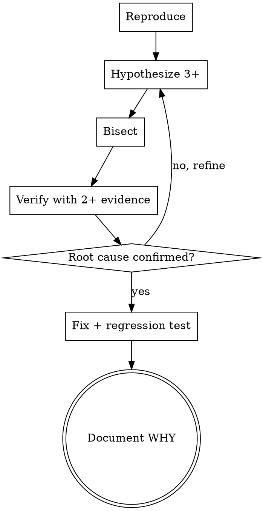

# loom-debug

claude-loom 専用の **systematic debugging skill**。bug や failing test に遭遇した時、ad hoc に潜るのではなく **規律ある推理プロセス** で根本原因を確定する。

## When to use

- developer agent が test を red にして実装したが、想定外の green / red になった
- reviewer agent が動作確認で予期せぬ挙動を発見
- CI / 実機検証で再現困難なバグに遭遇
- 「なぜか動かない」「直したつもりが直ってない」状態

このスキルを **使わない** 時：

- 単純な typo / lint error（fix 自明）
- test 仕様の誤解（test を読み直して終わり）
- environment setup 問題（README 読めば解決）

## Process



### 1. Reproduce

最小再現条件を確定：

- 環境 (OS / runtime version / dependency version)
- 入力 (exact bytes、edge case か)
- 状態 (DB rows / files / network / random seed)
- step-by-step replay で **2 回以上** 同じ結果が出ること

再現できなければ flake の可能性を疑う、それも仮説の 1 つ。

### 2. Hypothesis enumeration

原因候補を **3 つ以上** 列挙、優先順位付け：

| 例 | 仮説 | 優先度 | 検証コスト |
|---|---|---|---|
| H1 | 入力 validation の境界値漏れ | 高 | 低 (test 1 個) |
| H2 | 並行性 (race condition) | 中 | 高 (stress test) |
| H3 | 依存ライブラリ の version 互換性 | 低 | 中 (downgrade で再現確認) |

「とにかくこれが原因や！」と 1 仮説に飛びつく癖を **禁止**。複数仮説間の比較が debug の本質。

### 3. Bisect

二分法で切り分け：

- `git bisect` (新しい regression なら commit 単位で)
- 機能 toggle / commit out (該当行をコメントアウトして挙動変わるか)
- log injection (各 step に print / logger を仕込む)
- 入力サイズ / 状態を半分にして再現するか

二分法は **複雑度 log(N)** で原因に到達する最強の手法、必ず使え。

### 4. Verify with 2+ evidence

仮説と一致する証拠を **最低 2 つ** 見つける：

- log がそのタイミングで出る
- diff / git blame が一致
- 入力を変えると挙動が変わる
- root cause を **手動で再現できる** (制御可能性)

1 つの証拠だけで結論する癖を **禁止**。"correlation is not causation"。

### 5. Root cause vs symptom

表面エラーやなく **根本原因** を確定：

- 「null pointer なので null check 入れる」(symptom fix)
- 「null になる経路は X、そこで Y を処理せん設計が原因」(root cause fix)

5 whys（なぜを 5 回）で深掘り。

### 6. Fix + regression test

修正 → red を green に → **regression test を追加** （同じバグ再発防止）：

- regression test は失敗状態（fix 前）で red、fix 後 green を確認
- test 名に bug の特徴を残す (例: `test_handles_empty_input_gracefully`)

### 7. Document WHY

commit message に **root cause + fix の根拠** を記述（`docs/COMMIT_GUIDE.md` 参照）。必要なら `CHANGELOG` に。

```
fix(<scope>): <subject>

Root cause: <1-2 sentences>
Fix: <approach>
Regression: tests/<path>::<test_name>
```

## claude-loom 規約 hook

- TDD cycle と相補：`loom-tdd-cycle` skill が green 目標、`loom-debug` は red の中身を解剖
- developer agent から呼ばれる、reviewer 指摘でも使う
- commit prefix `fix:` (CC 準拠)
- 重大 bug は CHANGELOG に記録 (M5 で正式採用)

## Anti-patterns

- 1 つの仮説に飛びつく (3 つ以上列挙必須)
- 1 つの証拠で結論 (2 つ以上必須)
- symptom fix で済ます (root cause 確定が必須)
- regression test を書かない (再発防止漏れ)
- "とりあえず動くようにした" commit message (WHY 必須)
