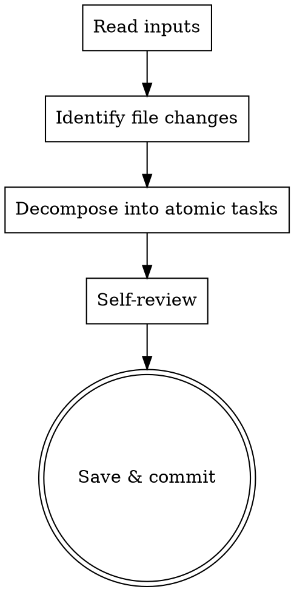

# loom-write-plan

claude-loom 専用の **lightweight implementation plan generator**。spec → master PLAN.md milestone → detailed plan の 3 段階のうち最終段を担う。

## When to use

- 新 milestone の **軽量 plan**（~200-300 行、28-task 大型 / ~50-80 行、4-task 小型）を生成する時
- subagent-driven-development / dispatching-parallel-agents 起動の前提として

このスキルを **使わない** 時：

- SPEC のブレインストーミング段階（PM agent の spec phase で対応）
- master PLAN.md の milestone 一覧編集（PM が直接編集）
- 1-2 タスクの ad-hoc な作業（直接 TodoWrite で十分）
- 既存 verbose plan (M0.8/M0.9) のリファクタ（凍結 policy、migrate せず）

## Output structure

生成する Markdown ファイルは以下のセクションを必ず含む：

### Plan-level 構造

| section | 必須/任意 | 役割 |
|---|---|---|
| Header (Goal / Architecture / Tech Stack) | 必須 | milestone 全体把握 |
| File Structure | 必須 | touch ファイル overview |
| Batch 編成 | 任意 | 並列化 hint（sequential のみなら省略可） |
| Tasks 1-N | 必須 | 軽量 Task list |
| Self-Review | 必須 | spec coverage / placeholder / type consistency 3 軸 |
| Risks | 任意 | 非自明な時のみ |

### 必須 5 フィールド per Task

```markdown
### Task N: <name>

**Goal**: 1 文で達成目標
**Files**: create/modify/test の touch list (relative paths)
**Spec ref**: 内容を導出する design spec / SPEC のセクション pointer
**Integrity check**: 1 行 grep/jq/wc command + 期待値
**Commit prefix**: Conventional Commits prefix + subject
```

### 任意 3 フィールド（必要時のみ）

- **Insertion points**: doc 編集の挿入 anchor（位置が複数あって自明じゃない時）
- **TDD**: red→green 経路（`red: <test path> → green: <pass criteria>`）
- **Notes**: edge case / 落とし穴

### サイズ目標

- 28-task 大型 milestone: ~200-300 行
- 4-task 小型 milestone: ~50-80 行

### Concrete example（M0.9 Task 1 を軽量版で書き直した例）

```markdown
### Task 1: SPEC.md §3.6.5 / §3.10 / §6.9.4 追加

**Goal**: Customization Layer policy / superpowers Indep / agents.* schema を SPEC に明記
**Files**: `SPEC.md` (modify)
**Spec ref**: design spec §1.2, §4
**Insertion points**:
- §3.6.5 → §3.7 の直前
- §3.10 → `## 4. アクター` の直前
- §6.9.4 → §6.9.3 の直後
**Integrity check**: `grep -cE "^### (3\\.6\\.5|3\\.10|6\\.9\\.4) " SPEC.md` → `3`
**Commit prefix**: `docs(m0.9): SPEC §3.6.5 / §3.10 / §6.9.4 追加`
```

## Process



### Step-by-step

1. **Read inputs**
   - `SPEC.md` の該当 milestone セクション
   - `docs/plans/specs/YYYY-MM-DD-<topic>-design.md` の設計 SSoT（あれば）
   - `PLAN.md` の master milestone task list（id 整合性チェック）
2. **Identify file changes**
   - 新規作成 / 編集 / 削除する全ファイルを列挙
   - 各ファイルがどの Task で触られるかマッピング
3. **Decompose into atomic tasks**（軽量フィールドで列挙）
   - 必須 5 フィールド + 任意 3 フィールドで各 Task を記述
   - exact code は plan に書かん、design spec / SPEC へ pointer に留める
   - TDD 順 (test red → impl green → refactor) を維持
4. **Self-review**（spec coverage / placeholder / type 一貫）
   - SPEC / design spec の各要件が task でカバーされとるか
   - placeholder ("TBD" / "TODO" / "後で" 等) を grep で検出、ゼロ確認
   - type / function 名が後タスクで一貫しとるか
5. **Save & commit**
   - 出力先：`docs/plans/YYYY-MM-DD-claude-loom-mN-<topic>.md`
   - branch: `feat/mN-<topic>`
   - commit prefix: `docs(plan):`

## claude-loom 規約 hook

- 出力先：`docs/plans/`（superpowers:writing-plans の `docs/superpowers/plans/` を上書き）
- master PLAN.md schema：`<!-- id: m*-t* status: * -->` 形式の checkbox と整合
- commit 規約：`docs/COMMIT_GUIDE.md` の Conventional Commits 11 prefix
- branch 規約：GitHub Flow、`feat/<short-kebab>` 命名
- **exact code は plan に書かん、design spec / SPEC へ pointer**（Task に全文転記は anti-pattern）
- **既存 verbose plan (M0.8/M0.9) は凍結**、新 plan のみ軽量版で生成（migrate せず）

## Anti-patterns

- task 内に "TBD" / "TODO" / "後で" 等の placeholder
- task 同士の type / function 名の食い違い（Task 3 で `clearLayers()` Task 7 で `clearAllLayers()`）
- commit step の欠落（atomic boundary が不明瞭になる）
- test より impl が先（TDD red 漏れ）
- master PLAN.md task id (`m*-t*`) と detailed plan の番号食い違い
- **Task 内に exact code を全文転記**（軽量版規範違反、design spec / SPEC への pointer に置き換えよ）
- **Task ごとに HEREDOC commit message を完全文記述**（subagent が compose する形に委譲、prefix + 1 行 subject のみで十分）
- **既存 verbose plan を migrate しようとする**（凍結 policy 違反、新 plan のみ軽量版で生成）
