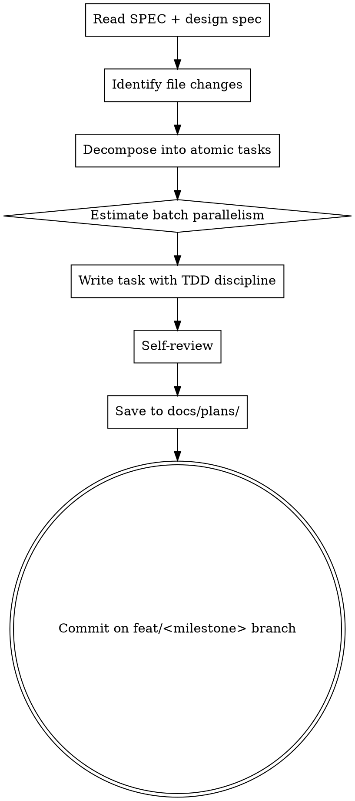

# loom-write-plan

claude-loom 専用の **detailed implementation plan generator**。spec → master PLAN.md milestone → detailed plan の 3 段階のうち最終段を担う。

## When to use

- 新しい milestone の実装プランを書き出す時（例：M0.9 完了後、M0.10 plan を作成）
- 既存 milestone の plan が古くなって rewrite する時
- subagent-driven-development / dispatching-parallel-agents 起動の前提として

このスキルを **使わない** 時：

- SPEC のブレインストーミング段階（PM agent の spec phase で対応）
- master PLAN.md の milestone 一覧編集（PM が直接編集）
- 1-2 タスクの ad-hoc な作業（直接 TodoWrite で十分）

## Output structure

生成する Markdown ファイルは以下のセクションを必ず含む：

1. **Header** — Goal / Architecture / Tech Stack
2. **File Structure** — Create / Modify するファイルツリー、各ファイルが Task N でどう触られるか
3. **Batch 編成** — 並列実行可能な task 群を分類（subagent-driven / parallel-agents の使い分け hint）
4. **Task 1〜N** — bite-sized step（2-5 min）形式
   - Files (Create / Modify / Test) のヘッダ
   - 各 step に exact code + exact path + exact command
   - 末尾に commit step（Conventional Commits 準拠 message + Co-Authored-By footer）
5. **Self-Review** — spec coverage / placeholder scan / type consistency

## Process

### Step-by-step

1. **Read inputs**
   - `SPEC.md` の該当 milestone セクション
   - `docs/plans/specs/YYYY-MM-DD-<topic>-design.md` の設計 SSoT
   - `PLAN.md` の master milestone task list（id 整合性チェック）
2. **Identify file changes**
   - 新規作成 / 編集 / 削除する全ファイルを列挙
   - 各ファイルがどの Task で触られるかマッピング
3. **Decompose into atomic tasks**
   - 1 task = 1 論理変更 (200 行以下推奨、500 行超は分割 — `docs/COMMIT_GUIDE.md` 参照)
   - TDD 順 (test red → impl green → refactor) を維持
   - 並列化可能タスクは独立性確認 (shared state なし)
4. **Estimate batch parallelism**
   - 並列タスク → `dispatching-parallel-agents` 推奨
   - 順次タスク → `subagent-driven-development` 推奨
   - Batch 編成表を Header 直後に配置
5. **Write task with TDD discipline**
   - 各 step は 2-5 min
   - exact code (placeholder 禁止)
   - exact command + expected output
   - commit step は Conventional Commits 規約、`docs/COMMIT_GUIDE.md` 参照
6. **Self-review**
   - SPEC / design spec の各要件が task でカバーされとるか
   - placeholder ("TBD" / "TODO" / "Add appropriate" 等) を grep で検出、ゼロ確認
   - type / function 名が後タスクで一貫しとるか
7. **Save & commit**
   - 出力先：`docs/plans/YYYY-MM-DD-claude-loom-mN-<topic>.md`
   - branch: `feat/mN-<topic>`
   - commit prefix: `docs(plan):`

## claude-loom 規約 hook

- 出力先：`docs/plans/`（superpowers:writing-plans の `docs/superpowers/plans/` を上書き）
- master PLAN.md schema：`<!-- id: m*-t* status: * -->` 形式の checkbox と整合
- commit 規約：`docs/COMMIT_GUIDE.md` の Conventional Commits 11 prefix
- branch 規約：GitHub Flow、`feat/<short-kebab>` 命名

## Anti-patterns

- task 内に "TBD" / "TODO" / "後で" 等の placeholder
- task 同士の type / function 名の食い違い (Task 3 で `clearLayers()` Task 7 で `clearAllLayers()`)
- commit step の欠落（atomic boundary が不明瞭になる）
- test より impl が先（TDD red 漏れ）
- master PLAN.md task id (`m*-t*`) と detailed plan の番号食い違い
